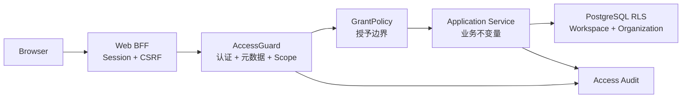

# 权限控制体系修复实施文档

日期：2026-07-20

状态：已实施并通过自动化验证；待部署数据库迁移与生产密钥

适用范围：`@hermes-swarm/core`、`@hermes-swarm/rbac-api`、`@hermes-swarm/rbac`、`@hermes-swarm/api`、`@hermes-swarm/web`

## 1. 背景与结论

当前权限体系已经具备以下基础：

- Platform、Workspace、Organization 三层主体和资源边界明确；
- 平台账号与租户账号使用独立身份面；
- 租户请求通过服务端会话取得 Workspace ID，不接受浏览器指定 Workspace Scope；
- Workspace-owned 表启用 PostgreSQL RLS，并使用不能绕过 RLS 的数据库角色；
- Integration Token 使用“Token 声明权限 ∩ Owner 当前有效权限”；
- 登录日志、操作日志及跨租户数据库隔离已有自动化覆盖。

本轮 Review 发现的问题集中在权限判断之外的安全闭环，包括：

1. 通用个人资料接口可以绕过当前密码校验修改密码；
2. Admin 缺少“可授予角色和权限上限”，可以晋升为 Owner；
3. 修改或重置密码后，已有 Access/Refresh Session 继续有效；
4. 生产环境允许使用代码内公开默认密钥；
5. Access 元数据不完整时存在静默放行路径；
6. Workspace/Organization Owner 连续性约束不完整；
7. 登录和密码重置接口缺少应用层分布式限流；
8. 管理 BFF 没有对修改请求执行 CSRF 来源校验；
9. 平台页面权限与后端 API 权限表现不一致；
10. Organization Scope 只有代码层隔离，缺少数据库纵深防御。

本实施文档将以上问题拆分为可独立交付、验证和回滚的修复工作包。

| Review 发现 | 优先级 | 修复工作包 | 发布要求 |
| --- | --- | --- | --- |
| 通用资料接口绕过旧密码校验 | P1 | R1 | 生产前阻断 |
| Admin 可以晋升 Owner | P1 | R2 | 生产前阻断 |
| 改密后旧会话继续有效 | P1 | R1 | 生产前阻断 |
| Production 接受公开默认密钥 | P1 | R4 | 生产前阻断 |
| Access 元数据不完整时静默放行 | P2 | R5 | 生产前阻断 |
| Owner 连续性不完整 | P2 | R3 | 生产前阻断 |
| 公共认证接口缺少限流 | P2 | R6 | 首批安全加固 |
| 管理 BFF 缺少 CSRF 来源校验 | P2 | R7 | 首批安全加固 |
| 平台页面与 API 权限不一致 | P3 | R8 | 体验与误操作修复 |
| Organization Scope 缺少数据库保护 | Defense-in-depth | R9 | 独立迁移发布 |

## 2. 修复目标

### 2.1 必须达成

- 任何修改登录凭据的入口都必须使用专用 Payload、专用 Service 方法和明确的会话失效策略。
- Admin 只能授予自己有权授予的角色和权限，不能通过成员管理、邀请或角色编辑晋升为 Owner。
- 所有凭据变更在数据库事务提交后立即使旧会话不可用，即使 Redis 清理暂时失败。
- Production 环境缺少独立高熵密钥时启动失败，不再使用公开默认值。
- `/api/admin/**` 权限元数据缺失或无法完整解析时一律失败关闭。
- Platform、Workspace、Organization 都必须至少保留一个有效 Owner/Admin。
- 公共认证入口具备应用层分布式限流，并保留上游 CDN/WAF 的第二层保护。
- 所有管理写请求必须校验可信来源，不能仅依赖 `SameSite=Lax`。
- 前端页面、导航、按钮与后端权限使用同一份运行时权限事实。
- Organization-owned 数据最终具备数据库级 Organization Scope 保护。

### 2.2 不在本轮范围

- 不改变 `Platform → Workspace → Organization` 资源模型。
- 不引入跨 Workspace 的统一管理员账号。
- 不引入 Organization 级设置或 Organization 级 Integration Token。
- 不通过前端隐藏替代后端授权。
- 不记录密码、Token、Cookie、请求体、响应体或 Secret 明文。
- 不把 `defaultRoles` 继续作为运行时权限兜底。

## 3. 统一安全约定

| 主题 | 约定 |
| --- | --- |
| 权限事实来源 | 数据库中启用的角色权限是唯一运行时事实；`defaultRoles` 只用于初始化和迁移 |
| 失败策略 | 认证、授权、Scope、元数据和生产密钥均失败关闭 |
| Owner 角色 | Platform Admin、Workspace Owner、Organization Owner 为受保护系统角色 |
| 角色授予 | 非 Owner 不能授予受保护角色；普通角色权限必须是操作者有效权限的子集 |
| 自我操作 | 允许修改普通个人资料；改密、改邮箱、停用、删除、改角色使用独立敏感操作 |
| 凭据变更 | 所有旧会话立即失效，当前会话也要求重新登录 |
| 多存储一致性 | 数据库中的凭据版本负责立即失效，Redis 会话删除负责清理，不依赖 Redis 删除保证安全 |
| 页面权限 | 前端只负责体验；后端 Guard 和数据库约束始终是最终边界 |
| 审计 | 所有允许、拒绝和异常结果保留安全化审计上下文 |

## 4. 目标权限链



每一层只承担自己的职责：

- BFF：保护浏览器 Session、校验写请求来源、刷新 Token；
- Guard：验证主体、权限定义和请求 Scope；
- Grant Policy：判断操作者是否可以授予目标角色或权限；
- Service：保证 Owner 连续性、状态流转和业务不变量；
- RLS：阻止代码缺陷演变为跨 Scope 数据泄漏；
- Audit：记录允许、拒绝、异常和敏感管理动作。

## 5. 工作包 R1：收紧用户更新与凭据变更

### 5.1 当前问题

- `UpdateUserPayload = Partial<CreateUserPayload>`，包含 `password`、`status` 和 `roleId`。
- `PATCH /api/admin/users/me` 可以进入通用 `applyUserPatch()` 修改密码。
- 专用 `POST /api/admin/users/me/password` 虽然校验当前密码，但成功后不撤销旧会话。
- Password Reset 更新密码后不撤销旧会话。

### 5.2 数据契约调整

在 `apps/api/src/common/admin-api.types.ts` 拆分 Payload：

```ts
type UpdateSelfProfilePayload = {
  displayName?: string;
  firstName?: string | null;
  imageUrl?: string | null;
  lastName?: string | null;
  mobile?: string | null;
  username?: string | null;
};

type UpdateManagedUserPayload = {
  displayName?: string;
  firstName?: string | null;
  imageUrl?: string | null;
  lastName?: string | null;
  mobile?: string | null;
  status?: UserStatus;
  username?: string | null;
};
```

约束：

- `UpdateSelfProfilePayload` 不允许 `password`、`status`、`roleId`；
- `UpdateManagedUserPayload` 不允许 `password`、`roleId`；
- 角色只通过 `PUT /admin/users/:userId/role` 修改；
- 密码只通过专用改密或管理员重置接口修改；
- 未知字段由全局 Validation Pipe 拒绝，不能静默忽略。

### 5.3 凭据版本

为 `users` 和 `platform_users` 增加：

```text
credential_version integer NOT NULL DEFAULT 0
credentials_changed_at timestamptz NULL
```

会话记录增加 `credentialVersion`。登录时写入当前版本；每次验证 Access Token 或 Refresh Token 时：

1. 查询有效主体；
2. 比较数据库 `credential_version` 与会话记录；
3. 不一致时返回 `401`，错误码 `AUTH_CREDENTIALS_CHANGED`；
4. 异步删除该用户剩余 Redis 会话。

改密和密码重置必须在同一个数据库事务中：

1. 更新密码 Hash；
2. `credential_version = credential_version + 1`；
3. 更新 `credentials_changed_at`；
4. 提交事务；
5. 清理全部 Redis Session；
6. 当前 Web Session Cookie 清除并跳转到对应登录页。

数据库版本比较负责安全性，因此 Redis 暂时不可用时旧会话仍然失效。

### 5.4 API 行为

保留：

- `POST /api/admin/users/me/password`
- `POST /api/admin/auth/request-password`
- `POST /api/admin/auth/reset-password`

新增管理员重置时使用：

- `POST /api/admin/users/:userId/password-reset`

管理员重置接口必须是独立危险权限，不能复用用户基础资料更新权限。

成功响应统一返回：

```json
{
  "success": true,
  "reauthenticationRequired": true
}
```

### 5.5 验收

- `PATCH /users/me` 携带 `password` 返回 `400`；
- 当前密码错误时改密失败；
- 改密成功后当前 Access Token、Refresh Token 和其他设备 Session 全部返回 `401`；
- Password Reset 成功后所有旧会话立即失效；
- Redis 清理失败时，凭据版本仍能阻止旧会话；
- 管理员重置密码进入操作日志，不记录新密码。

## 6. 工作包 R2：建立角色和权限授予边界

### 6.1 新增 Grant Policy

在 `packages/rbac` 增加统一的 `RoleGrantPolicyService`，供用户管理、组织成员、平台成员、邀请和角色权限编辑复用。

输入至少包括：

```ts
type RoleGrantRequest = {
  actor: AccessPrincipal;
  actorPermissionCodes: string[];
  actorRoleNames: string[];
  targetRole: RoleDescriptor;
  targetUserId?: string;
  scope: "platform" | "workspace" | "organization";
};
```

### 6.2 授予规则

1. `platform-admin` 只能由当前 `platform-admin` 授予；
2. `workspace-owner` 只能由当前 `workspace-owner` 授予；
3. `owner` 只能由同一 Organization 的当前 `owner` 授予；
4. 非受保护角色的权限集合必须是操作者在同一 Scope 下有效权限的子集；
5. 操作者不能通过编辑自定义角色获得自己当前没有的权限；
6. 操作者不能先创建高权限角色，再把该角色分配给自己；
7. 邀请创建、邀请接受前都重新执行相同校验；
8. 权限判断使用最新数据库状态，不能只相信登录快照。

### 6.3 覆盖入口

- `UsersService.create`
- `UsersService.replaceWorkspaceRole`
- `MembershipsService.create`
- `MembershipsService.replaceRole`
- `PlatformMembersService.create/update`
- `InviteService.create/accept`
- Workspace Role 权限替换
- Organization Role 权限替换
- Platform Role 权限替换

### 6.4 错误和审计

拒绝时返回 `403`，内部错误码：

- `ROLE_GRANT_PROTECTED`
- `ROLE_GRANT_EXCEEDS_ACTOR`
- `ROLE_GRANT_SELF_ESCALATION`
- `PERMISSION_GRANT_EXCEEDS_ACTOR`

操作日志记录：

- Actor；
- Scope；
- 目标用户；
- 当前角色和目标角色；
- 拒绝原因码；
- 不记录完整请求体。

### 6.5 验收

- Workspace Admin 给自己或他人设置 Workspace Owner 返回 `403`；
- Organization Admin 设置 Owner 返回 `403`；
- 自定义平台角色即使有成员更新权限，也不能设置 Platform Admin；
- Admin 不能创建包含 Owner-only 权限的自定义角色；
- Owner 仍可授予 Owner，但不能移除最后一个有效 Owner；
- 邀请路径和直接成员更新路径得到相同结果。

## 7. 工作包 R3：统一 Owner 连续性

### 7.1 Workspace

以下动作必须在事务中锁定目标用户、Owner 角色及有效 Owner 分配：

- 修改 Workspace Owner 角色；
- 禁用 Workspace Owner；
- 删除 Workspace Owner；
- 删除或禁用 Workspace 本身导致 Owner 不可用的管理动作。

有效 Workspace Owner 定义：

```text
user.status = active
AND user.deleted_at IS NULL
AND role.name = workspace-owner
AND role assignment enabled
```

任何事务提交后必须至少剩余一个有效 Workspace Owner。

### 7.2 Organization

有效 Organization Owner 定义：

```text
membership.status = active
AND membership 未删除
AND user.status = active
AND user 未删除
AND role.name = owner
```

`MembershipsService.update()` 在修改状态前也必须执行 Owner 连续性检查。Owner 数量查询必须关联 Membership 和 User 状态，不能只统计 Role Assignment。

### 7.3 并发

使用与 Platform Admin 连续性相同的悲观锁策略。必须增加两个并发请求同时删除/禁用不同 Owner 的 E2E，确保最多一个成功。

### 7.4 验收

- 不能禁用或删除最后一个有效 Workspace Owner；
- 不能禁用、删除或降级最后一个有效 Organization Owner；
- 已禁用 Owner 不计入有效 Owner 数量；
- 两个并发危险操作不能共同破坏 Owner 连续性；
- Platform、Workspace、Organization 返回一致的业务错误结构。

## 8. 工作包 R4：生产密钥与密钥轮换

### 8.1 生产启动要求

Production 必须显式配置且彼此独立：

- `AUTH_SESSION_SECRET`
- `WEB_SESSION_SECRET`
- `SETTINGS_ENCRYPTION_KEY`
- `INVITE_TOKEN_SECRET`
- `PASSWORD_RESET_TOKEN_SECRET`

要求：

- 不允许回退到代码默认值；
- 不允许多个用途共用同一密钥；
- 解码后至少 32 字节随机数据；
- 启动日志只显示密钥是否配置和 Key ID，不显示值；
- `.env.example` 只保留生成说明，不提供可直接使用的固定值。

Development/Test 可以使用明确标记的测试默认值，但不能通过同一分支进入 Production。

### 8.2 Session 密钥轮换

Session Token 增加 `kid`：

- 签发只使用当前 Key；
- 验证短期支持当前 Key 和上一把 Key；
- 轮换窗口结束后删除旧 Key；
- 紧急轮换可以仅保留新 Key，使全部会话立即失效。

### 8.3 Settings Secret 轮换

Secret 密文信封增加 Key ID：

```text
enc:v2:<kid>:<nonce>:<ciphertext>:<tag>
```

读取支持旧格式和新格式；保存时使用当前 Key。提供一次性迁移任务：

1. 使用旧 Key 解密；
2. 使用新 Key 重新加密；
3. 在事务中更新；
4. 统计成功、失败和跳过数量；
5. 不输出 Secret 明文。

新 Key 部署前必须确认旧 Secret 可读，避免直接切换导致环境变量和密钥参数不可恢复。

### 8.4 验收

- Production 缺少任何必需密钥时启动失败；
- 使用公开默认值或重复密钥时启动失败；
- Session Key 正常轮换期间旧 Token 可按窗口验证；
- 紧急轮换后旧 Token 全部失效；
- Settings Secret 迁移前后业务读取结果一致；
- 日志、错误和审计中不出现密钥内容。

## 9. 工作包 R5：Access Guard 全面失败关闭

### 9.1 运行时

`AccessGuard` 调整为：

```text
PublicAccess -> 显式放行
无 operation 且 /api/admin/** -> 拒绝
operation 无法解析完整 definition -> 拒绝
definition 不在同步后的权限目录 -> 拒绝
认证失败 -> 401
权限不足 -> 403
```

`resolveAccessDefinition()` 返回空时不能 `return true`。返回统一错误码：

- `ACCESS_METADATA_MISSING`
- `ACCESS_METADATA_INVALID`
- `ACCESS_DEFINITION_UNKNOWN`

### 9.2 启动时校验

Access Catalog 同步前扫描所有 Nest Controller：

- 管理 Handler 必须具有 `PublicAccess` 或可完整解析的 Access Definition；
- Permission ID 必须唯一；
- Scope 与 Controller 路径语义一致；
- Public Handler 必须记录公开原因；
- 发现错误时 Production 启动失败。

### 9.3 测试改造

删除 `admin-access-metadata.test.ts` 中手工维护的 Controller 清单，改为从 Nest Testing Module 或 Metadata Scanner 自动发现 Controller，覆盖：

- Platform Auth；
- Platform/Workspace/Organization Permission Catalog；
- Organization Roles；
- 后续新增 Controller。

增加“有 Operation、无 Resource”的反例测试，必须返回 `403`。

## 10. 工作包 R6：认证限流与密码计算

### 10.1 分布式限流

使用 Redis 实现应用层限流，建议初始值：

| 接口 | 维度 | 初始限制 |
| --- | --- | --- |
| Workspace/Platform Login | IP | 30 次/5 分钟 |
| Workspace/Platform Login | Workspace + 邮箱 Hash | 5 次/5 分钟 |
| Password Reset Request | IP | 10 次/15 分钟 |
| Password Reset Request | Workspace + 邮箱 Hash | 3 次/15 分钟 |
| Refresh | Session + IP | 60 次/分钟 |
| Workspace Context Discovery | IP | 60 次/分钟 |

限制值进入平台治理配置，但必须存在不可关闭的代码安全上限。

要求：

- 邮箱只以标准化后的 Hash 进入 Redis Key；
- 未知账号与有效账号返回相同外部响应；
- `429` 包含 `Retry-After`；
- CDN/WAF 限流继续保留，不能用上游限流替代应用限流；
- Redis 不可用时采用进程内保守限流，并产生告警。

### 10.2 密码计算

将同步 `pbkdf2Sync` 改为异步 `pbkdf2`，避免阻塞 Node Event Loop。保留现有 Hash 格式兼容读取；登录成功时可按新策略渐进升级 Hash。

如后续切换 Argon2id，应使用版本化 Hash 前缀，不在本修复中一次性重写全部密码。

## 11. 工作包 R7：管理 BFF 的 CSRF 防护

### 11.1 来源校验

对 `POST`、`PUT`、`PATCH`、`DELETE`：

1. 校验 `Origin` 与当前有效 Origin 完全一致；
2. 无 `Origin` 时检查 `Sec-Fetch-Site`，只允许 `same-origin`；
3. 拒绝 `cross-site` 和同主域兄弟子域发起的请求；
4. `X-Forwarded-Host/Proto` 只能使用可信代理覆盖后的值；
5. 认证、邀请、外部回调等例外必须使用独立 Route，不给通用 Admin BFF 添加宽松例外。

### 11.2 CSRF Token

Web Session 派生一个 Session-bound CSRF Token：

- 页面通过受保护只读接口获取；
- 修改请求使用 `X-CSRF-Token`；
- BFF 使用恒定时间比较；
- Token 不写入日志；
- Session 轮换时 CSRF Token 同步轮换。

继续使用：

- `HttpOnly`
- `Secure`（Production）
- `SameSite=Lax`
- Host-only Cookie

`SameSite` 是补充保护，不作为唯一 CSRF 边界。

### 11.3 验收

- 同源管理请求成功；
- 缺少或伪造 CSRF Token 的写请求返回 `403`；
- 来自兄弟 Workspace 子域的写请求返回 `403`；
- 普通 GET、登录跳转和邀请链接不受影响；
- BFF 不转发浏览器提供的 Authorization、Cookie 或伪造 Scope Header。

## 12. 工作包 R8：平台前端权限一致性

### 12.1 页面级权限

平台 Layout 使用与 Workspace Settings 相同的页面权限解析：

- 根据路径读取 `PAGE_ACCESS_DEFINITIONS`；
- 无页面权限时渲染统一 Access Denied；
- 平台设置导航只显示有权限的页面；
- 页面加载前不发送无权限 API；
- Direct URL 与侧边栏导航得到相同结果。

### 12.2 移除运行时默认角色兜底

`hasPageAccess()` 不再使用：

```ts
definition.defaultRoles.includes(role.name)
```

运行时只检查数据库返回且 `enabled=true` 的权限。`defaultRoles` 仅由 Seed、Catalog Sync 和迁移使用。

### 12.3 操作级权限

危险按钮必须按 Operation Permission 控制：

- 新增/删除平台管理员；
- 修改成员角色；
- 修改角色权限；
- 禁用/删除账号；
- 修改平台参数和 Secret。

按钮隐藏只改善体验；API 仍必须独立拒绝。

### 12.4 Web E2E 修复

同步修复当前两条等待已删除“当前生效”文案的陈旧断言。测试应根据稳定标签、输入值或来源徽标判断，不依赖已移除的展示文案。

## 13. 工作包 R9：Organization Scope 的数据库纵深防御

本工作包独立于紧急修复发布，避免一次迁移同时改变认证、授权和数据库策略。

### 13.1 适用表

仅处理具备非空 `organization_id`、且语义确实属于单个 Organization 的表，例如：

- Organization Role；
- Membership；
- Organization Role Assignment；
- Ticket/Conversation 等 Organization-owned 业务表。

Workspace-wide 表继续只使用 Workspace RLS。

### 13.2 Policy

组织表的基础谓词：

```sql
workspace_id = current_setting('app.workspace_id', true)::uuid
AND (
  current_setting('app.scope_level', true) = 'workspace'
  OR (
    current_setting('app.scope_level', true) = 'organization'
    AND organization_id =
      current_setting('app.organization_id', true)::uuid
  )
)
```

要求：

- Workspace Scope 可以在授权后读取本 Workspace 的多个 Organization；
- Organization Scope 只能访问一个精确 Organization；
- 缺少或非法 `scope_level/organization_id` 时返回零行或拒绝写入；
- Background Job 必须显式设置 Workspace 和 Organization Scope；
- Platform 跨租户操作继续使用独立 Platform DataSource。

### 13.3 上线策略

1. 盘点 Organization-owned 表；
2. 给所有查询补齐显式 Organization 条件；
3. 增加跨组织负向 E2E；
4. 在隔离数据库执行 Policy Migration；
5. 验证 Workspace Governor 的跨组织合法查询；
6. Production 分批启用并监控 RLS 拒绝。

## 14. 数据迁移

建议拆为独立迁移：

1. `CredentialVersion`
   - `users.credential_version`
   - `users.credentials_changed_at`
   - `platform_users.credential_version`
   - `platform_users.credentials_changed_at`

2. `EncryptedSettingKeyEnvelope`
   - 不立即改表；
   - 使用密文信封中的 `kid` 支持双 Key 读取；
   - 独立任务渐进重加密。

3. `OrganizationScopeRls`
   - 仅更新确认属于 Organization 的表；
   - 继续保留 Workspace Predicate；
   - Migration 测试检查 `ENABLE/FORCE ROW LEVEL SECURITY` 和完整谓词。

所有迁移必须增量执行，不允许重新生成或重置现有 Baseline。

## 15. 审计、监控和告警

### 15.1 新增审计动作

- `credential.change`
- `credential.admin_reset`
- `session.revoke_all`
- `role.grant`
- `role.grant_denied`
- `permission.replace`
- `owner.continuity_denied`
- `csrf.denied`

### 15.2 指标

- 登录成功/失败/限流数量；
- Password Reset 请求和完成数量；
- 凭据版本不一致拒绝数量；
- 角色授予拒绝数量及原因；
- Owner 连续性拒绝数量；
- Access 元数据错误数量；
- CSRF 拒绝数量；
- Redis 会话清理失败数量；
- RLS 拒绝和跨组织查询失败数量。

告警不得包含邮箱明文、Token、Session Cookie、Secret 或请求体。

## 16. 自动化测试矩阵

实施后基线：

- Core、RBAC API、RBAC、API、Web 共 329 个单元测试通过；
- 五个 Nx 项目的 TypeScript 类型检查和生产构建通过；
- API E2E 7/7 通过，包括真实 PostgreSQL Workspace/Organization RLS；
- Web E2E 14/14 通过，包括平台无权限 Direct URL；
- 原有两条等待已删除“当前生效”文案的陈旧断言已修复。

| 层级 | 必须新增的测试 |
| --- | --- |
| Core | 凭据版本字段、密钥信封版本、Organization-owned 表元数据 |
| RBAC API | 页面权限定义、受保护角色标识、稳定错误码 |
| RBAC | Grant Policy 子集判断、受保护角色、Access Definition 失败关闭 |
| API Unit | Self Payload 拒绝密码、改密版本递增、Owner 连续性、Invite 授予边界、生产密钥校验、限流 |
| API E2E | 旧 Access/Refresh Session 失效、Admin 自我晋升拒绝、并发最后 Owner、跨 Workspace/Organization RLS |
| Web Unit | `defaultRoles` 不参与运行时放行、CSRF Header、平台页面 Gate |
| Web E2E | 平台无权限 Direct URL、按钮权限、改密后跳转登录、兄弟子域 CSRF、陈旧本地化断言 |

必须执行：

```text
pnpm nx run-many -t test -p @hermes-swarm/core @hermes-swarm/rbac-api @hermes-swarm/rbac @hermes-swarm/api @hermes-swarm/web
pnpm nx run-many -t typecheck -p @hermes-swarm/core @hermes-swarm/rbac-api @hermes-swarm/rbac @hermes-swarm/api @hermes-swarm/web
pnpm nx run-many -t build -p @hermes-swarm/core @hermes-swarm/rbac-api @hermes-swarm/rbac @hermes-swarm/api @hermes-swarm/web
pnpm nx run @hermes-swarm/api:e2e
pnpm nx run @hermes-swarm/web:e2e
```

## 17. 分阶段实施顺序

| 阶段 | 内容 | 发布条件 |
| --- | --- | --- |
| Phase 0 | 盘点生产密钥、准备独立 Secret 和轮换方案 | 新密钥已进入部署环境，但尚未切换 |
| Phase 1 | Self Payload、凭据版本、改密/重置会话失效 | 凭据负向测试和 Session E2E 全部通过 |
| Phase 2 | Grant Policy、邀请校验、Owner 连续性 | 三个 Scope 的晋升和并发测试通过 |
| Phase 3 | Production 配置失败关闭、Access 元数据失败关闭 | Staging 使用生产配置成功启动 |
| Phase 4 | Redis 限流、异步 PBKDF2、CSRF | 压力测试和跨子域测试通过 |
| Phase 5 | 平台页面权限一致性、Web E2E 清理 | Direct URL、导航和按钮测试通过 |
| Phase 6 | Organization RLS | 独立数据库迁移及跨组织 E2E 通过 |

Phase 1–3 属于生产前阻断项；Phase 4–6 可以在不降低前面安全边界的前提下分批发布。

## 18. 回滚原则

- `credential_version` 是向后兼容的新增列，旧代码回滚时保留列；
- Session Key 轮换期保留上一把 Key，紧急安全事件除外；
- Settings Secret 在确认全部重加密成功前不能移除旧解密 Key；
- Grant Policy 和 Owner 连续性禁止通过 Feature Flag 在 Production 关闭；
- Organization RLS 使用独立迁移，必要时只回滚 Organization Predicate，不关闭 Workspace RLS；
- 任何回滚都不得恢复公开默认密钥或 Access Guard 静默放行。

## 19. 完成定义

- [x] 通用资料更新不能修改凭据、角色或账号状态
- [x] 所有凭据变更立即使全部旧会话失效
- [x] Workspace/Organization Admin 无法晋升 Owner
- [x] 自定义角色不能获得操作者自身没有的权限
- [x] Platform/Workspace/Organization 均至少保留一个有效 Owner/Admin
- [x] Production 缺少独立高熵密钥时启动失败
- [x] 所有管理接口 Access 元数据缺失或非法时失败关闭
- [x] 登录、刷新和密码重置具备分布式限流
- [x] 管理写请求具备 Origin 和 CSRF Token 校验
- [x] 平台页面、导航、按钮和 API 权限一致
- [x] Organization-owned 数据具备数据库级 Scope 防护
- [x] 新增拒绝路径全部进入安全化审计
- [x] 五个 Nx 项目的 test/typecheck/build 全部通过
- [x] API 与 Web E2E 全部通过
