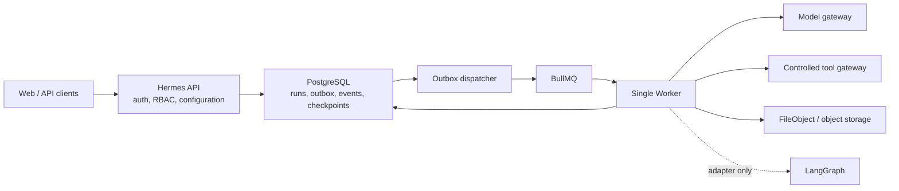
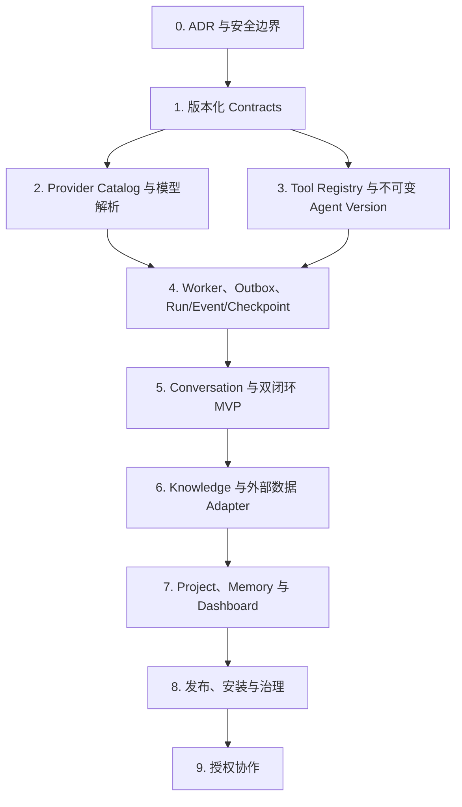

# AI Agent Runtime Foundation

状态：Accepted
更新日期：2026-07-25

## 决策摘要

Hermes 采用“版本化领域契约 + 受控能力网关 + 单一异步运行时”的 Agent
架构。API 负责认证、授权、配置、发布和任务编排，单一 Worker 负责所有模型、
工具与图执行。PostgreSQL 是 Run、Checkpoint、Event、Artifact 和投递状态的
权威数据源；BullMQ 只负责可重复投递的任务调度；LangGraph 只作为 Worker
内部的可替换执行适配器。

首个模型驱动为 OpenAI-compatible。Platform 与 Workspace Provider 分开存储和
授权，Secret 只允许写入或轮换，任何读取接口都不返回明文。Agent 只能通过受控
工具网关调用已登记的 HTTP 或 Streamable HTTP MCP 工具，不支持 MCP stdio、
Shell、浏览器执行代码或任意数据库访问。

## 目标与非目标

### 目标

- 为 Agent 编辑、版本发布、执行、流式事件、恢复和审计建立稳定且可演进的契约。
- 让模型 Provider、工具驱动、图执行器和队列实现都可以替换，不泄漏到业务模型。
- 让 Agent 与 Analytics 共享 Run、Event、Checkpoint、Artifact、Worker 和模型解析，
  但保持各自的领域边界。
- 在不恢复数据库 RLS 的前提下，以可信认证上下文和显式 `workspace_id` 条件实现
  Workspace 隔离。
- 支持 Workspace 默认模型、固定模型和经授权的单次模型覆盖，并记录每次实际解析
  结果、用量、延迟与成本。
- 通过 Feature Gate 逐步交付，不要求未完成的运行时能力随 Contract 一次上线。

### 非目标

- 不在 API 进程内执行 Agent 图、模型调用、长任务或不可信代码。
- 不提供通用工作流脚本、Shell/Python 执行器、MCP stdio 或用户上传的插件代码。
- 不允许客户端提交连接字符串、Provider Secret、任意模型端点或任意工具端点。
- 不让 BullMQ、Redis、LangGraph Checkpoint 或 SSE 成为业务状态的唯一真相来源。
- 不在本 ADR 中定义知识解析、向量检索、Dashboard、多人协作或公开市场的完整模型；
  它们必须建立在本文的运行时边界之上。

## 领域边界

| 领域 | 责任 | 不拥有 |
| --- | --- | --- |
| Provider Catalog | Platform/Workspace Provider、Deployment、Grant、Secret 引用与健康状态 | Agent 图、对话、任务执行 |
| Agent Studio | Agent、Draft、不可变 Version、发布选择 | Provider 凭据、Worker 状态 |
| Tool Registry | ToolDefinition、版本、Grant、连接配置引用 | 任意代码执行、Run 生命周期 |
| Runtime | Run、Outbox、Checkpoint、RunEvent、取消、重试、恢复 | Studio 编辑状态、Provider 明文 Secret |
| Conversation | 对话、消息、附件、Run 关联与流式读取 | 图调度、工具实现 |
| Artifact | 小型结构化结果与大型 FileObject 引用 | 领域对象的最终所有权 |

Analytics 可以将受控查询与可视化能力注册为工具，并复用 Runtime 与 Artifact；
它不能绕过 Query Gateway，也不能让 Agent 直接执行 SQL。Knowledge 等后续领域以
同样方式通过公开端口接入，不反向依赖具体的 Worker 或 LangGraph 类型。

## 版本化运行时契约

所有公共契约从 `packages/api-contracts` 的独立 `ai` 入口导出，并携带明确的
`schemaVersion`。持久化对象保存创建时使用的契约版本；读路径可升级旧版本，执行
路径只接受当前运行时声明支持的版本。未知字段和未知联合类型默认拒绝，避免执行器
静默改变含义。

### AgentGraph

`AgentGraph` 描述可执行拓扑，而不是 UI 画布状态。最小内容包括：

- `schemaVersion`、稳定节点 ID、入口节点和有向边。
- 受支持的节点类型及其版本化配置，例如模型调用、工具调用、条件分支和受控结束。
- 每个节点的输入/输出 Schema、错误边界、超时和明确的重试策略。
- 对 `ModelReference`、`ToolDefinition` 版本和其他已发布资源的稳定引用。
- 编译期校验结果，不包含 Provider Secret、Workspace ID 或运行时临时状态。

Draft 可以修改；发布后生成不可变 Agent Version。Run 永远固定到某个 Agent Version
及其图快照，后续编辑不得改变历史 Run 的语义。

### ModelReference

`ModelReference` 只表达模型选择意图，不保存端点或凭据。它支持三种解析模式：

| 模式 | 含义 | 约束 |
| --- | --- | --- |
| `workspaceDefault` | 运行时解析 Workspace 当前默认 Deployment | 必须存在有效 Grant |
| `pinned` | 固定 Provider Deployment 与模型 | 发布和运行时均验证可用性 |
| `requestOverride` | 调用者在允许集合内覆盖 | 需要专门权限，不能覆盖端点或 Secret |

Run 创建时将解析结果冻结为实际的 Provider、Deployment、模型标识和配置 revision，
并在结束时记录 token、延迟、重试和归一化成本。重放历史 Run 使用已记录结果；若原
Deployment 已停用，则明确失败或由人工创建新 Run，不静默切换模型。

### ToolDefinition

`ToolDefinition` 是可审计、可授权、版本化的工具声明，至少包含：

- 稳定名称、版本、说明以及严格的 JSON 输入/输出 Schema。
- 驱动类型：内部能力、受控 HTTP 或 Streamable HTTP MCP。
- 超时、响应大小、重试、副作用等级和幂等要求。
- 所需 Workspace/Platform Grant、允许的网络目标和凭据引用。
- 输出脱敏策略以及是否允许生成 Artifact。

Agent Version 固定工具版本。Tool Grant 在运行时再次校验，撤销授权后未开始的调用
必须失败；已经产生的历史事件仍保留审计信息，但不暴露 Secret 或敏感响应。

### ExecutionScope

`ExecutionScope` 由服务端从认证主体、授权结果和已验证资源生成，不能由请求正文
构造。它至少固定：

- `workspaceId`、发起账号、认证会话和 Platform/Workspace scope。
- Agent Version、Conversation、父 Run、请求关联与幂等键。
- 已解析的 Provider/Tool Grant 集合、预算、截止时间和取消标记。
- 数据分类、可用 Artifact/FileObject scope 与审计上下文。

所有 Worker Job 只携带 Run ID 和不可伪造的最小调度元数据。Worker 从 PostgreSQL
重新加载并验证 ExecutionScope，不信任 Queue payload 中的 Workspace 或 Grant。

### RunEvent

`RunEvent` 是只追加的版本化事件信封，包括 `schemaVersion`、Run ID、Workspace ID、
单调递增序号、事件类型、发生时间、节点/调用关联 ID 和脱敏后的 payload。事件类型
至少覆盖 Run 状态、节点状态、模型增量、工具调用、Artifact、Checkpoint、用量、
取消、错误和完成。

- PostgreSQL 中的事件序号是 SSE 游标和重连依据；Redis Pub/Sub 只能作为低延迟通知。
- 重复投递使用 `(run_id, event_key)` 或等价幂等键去重，不能产生重复副作用。
- 增量事件可以按策略压缩，但完成、错误、工具副作用、用量和 Artifact 事件必须保留。
- 对外事件投影必须再次执行权限检查与字段脱敏，内部事件表不是公共 API 响应。

## Provider 与 Secret 边界

Platform Provider 和 Workspace Provider 使用独立的持久化模型与服务入口：

- Platform Provider 由平台权限管理，可通过显式 Grant 向 Workspace 提供 Deployment。
- Workspace Provider 归属单一 Workspace，只能被该 Workspace 的有效成员按权限管理。
- 两类 Provider 不共享凭据行，不通过可空 `workspace_id` 混合权限语义。
- Agent、Conversation 和 Analytics 只保存 `ModelReference`，不能外键或复制 Secret。

Secret API 采用“只写不读”：创建和轮换请求接收明文，响应仅返回 Secret ID、掩码、
创建时间和轮换状态。明文经专用加密服务保存，只在 Worker 即将调用已授权 Provider
时短暂解密；不得进入日志、事件、Checkpoint、Artifact、错误详情、Queue payload 或
OpenAPI 示例。删除或撤销 Secret 后，新调用立即失败，既有审计记录保持可读。

OpenAI-compatible 是首个 Provider adapter。其模型列表、流式响应、工具调用和用量
被归一化到 Hermes 契约；业务代码不依赖供应商 SDK 类型。生产端点必须使用 HTTPS，
host 与解析后的网络地址均通过平台 allowlist，禁止回环、链路本地、私网和重绑定目标，
除非由平台显式配置的受信任网络策略允许。Workspace 不能提交任意 endpoint。

## 受控工具网关

所有外部工具调用都经 Worker 内的 Tool Gateway：

1. 以 Run 的 ExecutionScope 解析固定 ToolDefinition 版本与实时 Grant。
2. 使用严格 Schema 校验并限制输入字节数，拒绝未知或冲突的 Workspace 字段。
3. 应用目标 allowlist、DNS/IP 校验、超时、并发、响应大小与重定向策略。
4. 根据副作用等级注入幂等键；不安全且不可幂等的操作默认不自动重试。
5. 校验并截断输出，脱敏后写入 RunEvent；大结果转为 Workspace 范围的 Artifact。

首期外部驱动只包括受控 HTTP Connector 与 Streamable HTTP MCP。两者均使用平台
登记的连接与凭据，不接受运行时任意 URL。明确不支持 MCP stdio、Shell、子进程、
本地文件系统或 API 主机内工具执行。内部 Analytics 工具只能调用 Query Gateway，
并继续受字段白名单、行数、耗时和响应大小预算约束。

## 单一 Worker、队列与 Outbox

Hermes 新增一个共享 `apps/worker`，Agent、Analytics、Knowledge 等长任务以不同
job type 共用相同运行时框架；不为每个领域创建独立 Worker 项目。可复用且不依赖
Nest/TypeORM 的图契约、执行状态机和端口放入纯运行时包，API 与 Worker 依赖同一
版本。

PostgreSQL 事务同时写入业务状态和 Outbox。Dispatcher 以有界批次、行锁和租约读取
Outbox 并投递 BullMQ，成功后记录投递状态。BullMQ 采用至少一次投递，因此每个处理器
必须以 Run/step/idempotency key 抢占执行权并安全处理重复、过期租约与 Worker 崩溃。
Queue 丢失时可以从未完成 Outbox 重新构建；Redis 不保存唯一业务事实。

取消操作先持久化到 PostgreSQL，再通知 Worker。Worker 在节点边界、模型流和工具调用
前后检查取消与截止时间。超时或进程退出后，租约允许另一个 Worker 从最近有效
Checkpoint 恢复；外部副作用只有在工具声明提供幂等保障时才允许自动重试。

## Checkpoint、Event 与 Artifact

| 记录 | 用途 | 规则 |
| --- | --- | --- |
| Checkpoint | 恢复图状态和等待点 | 版本化、Workspace 范围、不可包含 Secret；原子推进 |
| RunEvent | 审计、流式投影和重连 | 只追加、严格排序、可脱敏、可从游标续传 |
| Artifact | 表格、图表、文件和结构化结果 | 小结果存 PostgreSQL；大结果引用 FileObject |

Checkpoint 保存领域中立的执行状态与 adapter state envelope，而不是直接暴露
LangGraph 内部表结构。Artifact 具有明确类型、Schema 版本、创建 Run、Workspace、
可见性和保留策略；大型结果先写私有对象存储，再在同一业务完成流程中持久化引用。
删除 Run 不自动删除仍被 Conversation、Analysis View 或其他领域绑定的 Artifact。

LangGraph 仅在 Worker 中实现图执行 adapter。它可以产生或读取 adapter state，但
`AgentGraph`、Run 状态、公共事件和 API 不导入 LangGraph 类型。替换执行器时保留
Hermes 的版本、授权、事件与恢复语义，不要求迁移上层领域模型。

## Workspace 隔离与授权

系统继续使用单 PostgreSQL DataSource 和应用层显式隔离，不恢复 RLS：

- 所有 Workspace 资源的 `workspace_id` 非空；创建时只从 ExecutionScope 强制写入。
- 读取、更新和删除同时匹配资源 ID 与可信 `workspace_id`，必要关联使用复合外键。
- Provider、Tool、Agent、Run、Checkpoint、Event 和 Artifact 的跨表查询均传播同一
  Workspace 条件，不能先按全局 ID 裸查再做业务判断。
- Platform 工作人员跨 Workspace 操作必须经过明确 Platform RBAC，并为目标 Workspace
  创建可审计的 ExecutionScope；Platform 权限不是隐式绕过过滤的开关。
- 请求 Header、Body、Tool 参数、Queue payload 和模型输出中的 `workspaceId` 均不可信。
- SSE 重连、Artifact 下载、Run 取消与历史读取每次都重新验证当前成员身份和 Grant。

授权采用两阶段：创建/发布时验证引用是否可用，运行时再次验证成员、Feature Gate、
Provider/Tool Grant 和资源状态。发布成功不代表永久获得外部能力。

## Feature Gates

| Gate | 控制范围 | 默认行为 |
| --- | --- | --- |
| `feature:ai:enabled` | Provider、Agent Studio、Run 与 Conversation | 关闭时路由不可用且不投递任务 |
| `feature:analytics:enabled` | Query Gateway 与分析工具 | 独立于模型能力关闭 |
| `feature:analytics-ai:enabled` | Agent 调用 Analytics 工具 | 同时要求 AI 与 Analytics 已启用 |
| `feature:knowledge:enabled` | 文档处理、检索与 Citation 工具 | 未启用时图发布拒绝相关工具 |
| `feature:dashboard:enabled` | Dashboard Artifact、查看与发布 | 不影响基础表格/图表结果 |

Gate 是产品启用条件，不替代 RBAC。API、发布校验、Run 创建和 Worker 执行都要检查；
运行中的 Gate 被关闭时，不再启动新节点，并按照可审计的取消/失败策略结束，而不是
继续执行隐藏能力。

## 安全与验证门槛

任何阶段进入下一阶段前，至少满足以下门槛：

- Contract schema、向后兼容升级、未知版本拒绝和 OpenAPI 响应校验。
- Workspace A/B 对 Provider、Agent、Run、SSE、Checkpoint、Event 和 Artifact 的读取、
  修改、取消、下载与 ID 猜测越权测试。
- Secret 创建/轮换/撤销、日志与错误脱敏、Queue/Checkpoint/Event 无明文扫描。
- Provider endpoint 与工具目标的 SSRF、重定向、DNS 重绑定、超时、响应过大测试。
- BullMQ 重复投递、Worker 重启、租约过期、取消、超时和 Outbox 恢复测试。
- 模型流断开与 SSE `Last-Event-ID` 重连不丢失最终状态，重复连接不重复副作用。
- Tool 输入/输出 Schema、Grant 撤销、副作用幂等和提示注入边界测试。
- 每次 Run 的实际模型 revision、token、延迟、错误与成本记录可核对。
- 受影响 Nx 项目的 `typecheck`、`test`、`build`，以及远程测试数据库的 migration/E2E。

生产日志只记录稳定 ID、状态、持续时间和归一化错误码。Prompt、模型输出、工具参数
和 Artifact 内容按数据分类策略处理，默认不进入普通日志或指标标签。

## 阶段依赖

- 阶段 1 只冻结语义与 Fake adapter，不依赖数据库执行器。
- 阶段 2 建立第一个非 AI 闭环：Provider Catalog 与默认模型解析可以独立验证。
- 阶段 3 在 Worker 之前完成工具、Agent Draft/Version 和发布期校验，但不能执行 Run。
- 阶段 4 是 Agent 与 Analytics 的共享关键路径；Outbox、幂等、恢复和隔离测试通过后，
  才能开放模型与工具的真实执行。
- 阶段 5 形成首个可发布闭环；后续 Knowledge、Dashboard、发布市场和协作只扩展公开
  端口，不改变本文的 Provider、Tool、Run 与 Workspace 信任边界。

## 结果与取舍

该设计以更多显式状态和持久化记录换取可恢复、可审计与可替换性。单一 Worker 降低
早期运维复杂度，也要求所有 job type 遵守统一预算与隔离规则；未来可以按队列或部署
水平扩容，但仍保持同一运行时契约。PostgreSQL Outbox 带来额外写放大，却消除了
“数据库已提交、任务未投递”的静默丢失窗口。LangGraph 能加速首期图执行，同时被
限制在 adapter 内，避免上层数据模型被单一框架锁定。
