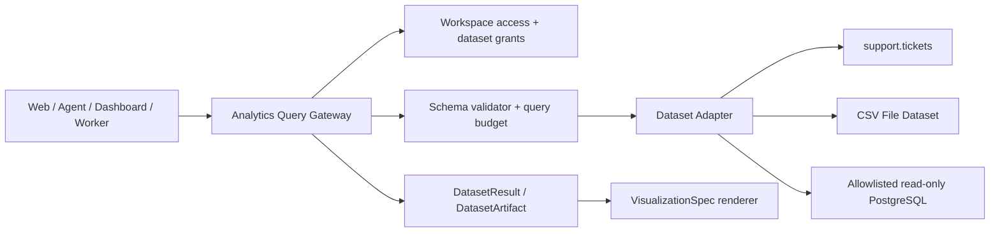

# Analytics Query and Visualization Foundation

Status: Accepted
Decision date: 2026-07-25

## Purpose

Hermes provides lightweight, workspace-scoped analysis without becoming a
general SQL console or an editable spreadsheet. Every caller—Web, Dashboard,
Agent, or background Worker—uses the same Query Gateway and the same typed
dataset contracts. Adapters translate the safe query model to a trusted data
source; clients never submit SQL, connection strings, ORM expressions, or
executable visualization code.

The first vertical slice exposes aggregate support-ticket data. CSV and
allowlisted read-only PostgreSQL sources are later adapters behind the same
boundary.

## Decision drivers

- Workspace isolation must remain explicit and fail closed without PostgreSQL
  RLS.
- A saved analysis must be reproducible after schemas, models, and UI code
  evolve.
- Human-authored and model-authored queries must receive identical validation,
  authorization, budgets, and audit treatment.
- Results and visualizations need stable public contracts that do not expose an
  adapter's implementation details.
- Small synchronous results and large asynchronous results should share one
  execution model rather than create separate analytics products.

## Domain boundary

Analytics lives under `apps/api/src/domains/analytics` and exports application
services rather than repositories. Shared public schemas live in
`packages/api-contracts/src/analytics`. UI code lives under
`apps/web/components/analytics` and calls public APIs only.

Infrastructure modules may provide identity, settings, files, queues, and
audit services to Analytics. Infrastructure must not import Analytics domain
code.

## Public contract decisions

### DatasetSchema

A dataset has a stable key, revision, display metadata, capabilities, and a
finite field catalog. Each field declares:

- a stable field key and scalar type;
- whether it may be selected, filtered, grouped, sorted, or aggregated;
- supported filter and aggregate operators;
- sensitivity and default visibility metadata;
- optional semantic hints such as time grain, unit, or format.

Adapters cannot add fields at query time. A query referencing an unknown or
unsupported field is rejected before an adapter runs.

### AnalysisQuery

`AnalysisQuery` is a declarative query tree containing only:

- selected dimensions;
- aggregate measures;
- typed filters;
- grouping and optional time grain;
- deterministic sorting;
- offset and limit.

The request does not contain `workspaceId`. The API resolves it from the
authenticated subject and passes it as an immutable `ExecutionScope` to the
gateway. Source-specific expressions, raw SQL, joins, subqueries, functions,
comments, and client-provided connection options are not part of the contract.

### DatasetResult

Every result records the dataset key and revision, normalized query, column
metadata, typed rows, truncation state, timing, and an opaque execution ID.
Public responses do not reveal table names, SQL text, object-storage keys, or
source credentials.

Small results are returned inline. Asynchronous or large results use an
`AnalysisQueryRun` and an immutable `DatasetArtifact` backed by `FileObject`.
The artifact records the exact normalized query, dataset revision, row count,
hash, and retention policy needed for replay and audit.

### VisualizationSpec

`VisualizationSpec` is data-only and versioned. The initial renderer accepts:

- `table`;
- `kpi`;
- `bar`;
- `line`;
- `area`;
- `pie`.

A spec references result column keys and a closed set of formatting options.
It cannot contain JavaScript, HTML, CSS, remote component URLs, template
expressions, or plugin identifiers. The gateway validates semantic
compatibility—for example, a line chart requires a sortable dimension and at
least one numeric measure—before saving or rendering it.

## Query Gateway and adapter contract

The Query Gateway is the only supported execution entry point. It performs, in
order:

1. resolve the authenticated account and trusted workspace scope;
2. check feature gates and Analytics RBAC;
3. resolve a registered dataset and its current schema revision;
4. normalize the query and reject unsupported fields or operators;
5. enforce structural and resource budgets;
6. execute through the selected adapter with cancellation and deadline signals;
7. validate and size the returned typed result;
8. persist run metadata, usage, and an artifact when required;
9. emit sanitized audit and run events.

An adapter implements schema discovery and query execution for a registered
source. It receives a validated query plus a server-created execution scope; it
does not receive arbitrary request objects. Adapters must apply workspace
conditions using the trusted scope even when their source also contains a
workspace field.

The Phase 1 fake adapter is deterministic and in-memory. It exists to verify
contracts, budgets, cancellation, and UI behavior without a database. It is
never registered as a production source.

## Initial budgets

| Limit | Default / maximum |
| --- | --- |
| Execution deadline | 10 seconds |
| Default row limit | 50 |
| Maximum row limit | 500 |
| Serialized inline response | 2 MiB |
| Group fields | 3 |
| Measures | 8 |
| Sort clauses | 3 |
| Filters | 30 |
| Values in one `in` filter | 100 |

Budgets are enforced before execution where possible and again on the result.
An adapter may impose tighter limits. A request cannot increase a limit; only a
server-side policy revision can do so. Timeout, cancellation, truncation, and
budget rejection use stable public error codes.

## First dataset: `support.tickets`

The initial dataset is workspace-scoped and read-only. It exposes only status
and time-oriented analytical fields, such as creation time, update time,
resolution time, status, and safe aggregate counts. It does not expose message
bodies, attachment metadata, email addresses, account profile data, or other
sensitive content.

Dataset authorization initially requires Workspace Owner or Admin access.
Later grants may broaden access, but a dataset grant can never bypass the
trusted workspace scope or the source adapter's row filter.

## Saved views, dashboards, and revisions

An `AnalysisView` stores a normalized query and optional visualization with an
integer revision. Updates require `expectedRevision`; stale writes fail with a
conflict. A dashboard follows the same draft/revision rule and references saved
views or immutable dataset artifacts.

Published dashboard revisions are immutable. The initial viewer is available
only to authenticated members of the owning workspace. Public anonymous links,
third-party widget code, and browser-side query execution are excluded.

Dashboard changes proposed by an Agent follow
`proposal -> preview -> confirm -> apply`. A model cannot directly mutate a
saved view or dashboard.

## AI integration

Analytics tools expose the same controlled gateway operations used by the Web:

- list permitted datasets;
- describe a dataset schema;
- submit a typed query;
- propose a visualization;
- explain an existing result.

Tool output is treated as untrusted data and never promoted to system
instructions. The Assistant receives only permitted schema metadata and
bounded results. It cannot request hidden fields, bypass budgets, or inject raw
SQL. Each run records the actual model binding, dataset revision, normalized
query, tool events, tokens, latency, and cost.

The Analytics Assistant supports `workspaceDefault`, `pinned`, and authorized
`requestOverride` model resolution. A request override selects from an existing
grant; it cannot provide a provider endpoint or secret.

## Feature gates and rollout

| Gate | Capability |
| --- | --- |
| `feature:analytics:enabled` | Dataset catalog, query, result table, saved views |
| `feature:analytics-ai:enabled` | Analytics tools and Assistant binding |
| `feature:dashboard:enabled` | Dashboard viewer, then designer and publishing |

Disabled features do not register navigation or permit execution. Stored data
is retained so a gate can be re-enabled safely.

Rollout order is contract and fake adapter, ticket explorer, visualizations and
saved views, shared asynchronous runtime and artifacts, AI Assistant, external
adapters, then dashboards and governance.

## Security and isolation invariants

- Workspace identifiers come only from the authenticated server context.
- Every workspace-owned entity has a non-null `workspace_id`; reads, updates,
  deletes, relations, artifacts, events, and checkpoints include it explicitly.
- Cross-workspace platform operations require Platform RBAC and a deliberately
  selected target workspace; they do not use a fail-open repository path.
- Dataset credentials are encrypted infrastructure secrets and are write-only
  through public APIs.
- PostgreSQL adapters use a separately provisioned read-only credential,
  host/network allowlists, statement timeouts, and an allowlisted schema.
- CSV datasets bind to an authorized ready `FileObject`; schema inference is
  asynchronous and requires user confirmation before querying.
- Query text, model prompts, result rows, signed URLs, and credentials are not
  written to ordinary application logs.

## Verification gates

Each Analytics slice must cover contract parsing, stable errors, query
normalization, budgets, cancellation, result validation, and Workspace A/B
isolation. Adapter tests include illegal fields and operators, excessive
complexity, oversized results, deterministic ordering, timeouts, and source
failure sanitization.

Web tests cover loading, empty, error, truncated, keyboard, and responsive
states. AI tests additionally cover prompt injection in source data, revoked
grants, model override authorization, tool-call budgets, and replayable run
events. Database-backed phases run migrations and isolation E2E against the
configured remote test services; local Docker is not part of the workflow.

## Explicit non-goals

This foundation does not provide raw SQL, DDL/DML, editable spreadsheet cells,
arbitrary joins, executable plugins, browser-side source credentials, public
anonymous dashboards, XMLA/MDX, third-party widget code, or an API-hosted
Shell/Python runtime.
