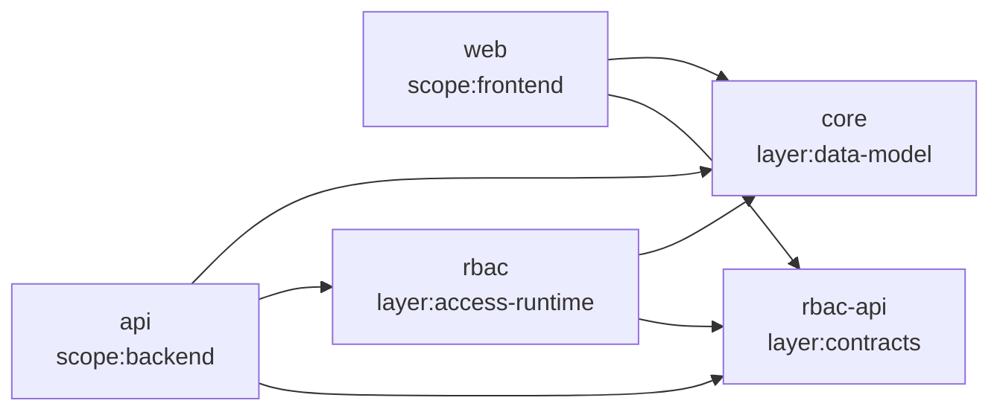

# 架构 Review：2026-07-17

## 结论

当前工作区的 Nx 项目依赖方向健康，没有循环依赖；Platform → Tenant → Organization 的身份与权限边界也已有明确文档和测试。主要风险不在项目间依赖，而在项目内部：业务域与基础设施混放、少数超大文件持续吸收职责，以及缺少真正可运行的 lint 门禁。

本轮已完成低风险结构修正：

- 将 Ticket、Conversation 和 Ticket 归档任务从 `infrastructure/common` 收拢到 `apps/api/src/domains/support`。
- 将 Ticket/Conversation 实体从 `packages/core/src/notifications` 拆到 `packages/core/src/support`，根导出保持兼容。
- 将 Ticket 页面移到 `apps/web/app/(console)/(domains)/tickets`；Next.js route group 不改变 `/tickets` URL，并继续继承 Console shell。
- 为 5 个 Nx 项目补充 `projectType` 和 scope/layer tags，使项目图能表达应用、共享层与后端运行时边界。
- 将 5 个项目的 `clean` 脚本改为跨平台 Node 文件系统调用，并同步清理 `tsconfig.tsbuildinfo`，避免删除 `dist` 后增量编译错误地跳过输出。
- 让 OpenAPI preview 在导入 `AppModule` 前准备隔离的占位数据库身份；生成元数据不再依赖当前 shell 预先注入运行时数据库 URL。
- 移除 `api:dev` 内部的嵌套 Nx 调用，改由 target 的 `dependsOn: ["^build"]` 构建共享依赖，避免 Windows 上子 Nx 完成后挂起启动链。

## 当前依赖方向



`api` 内部依赖顺序：

```text
runtime bootstrap -> infrastructure + domains
domains -> common runtime + infrastructure public services
infrastructure -> common runtime
infrastructure -X-> domains
```

## Review 发现

| 优先级 | 发现 | 影响 | 本轮处理 |
| --- | --- | --- | --- |
| P1 | Ticket/Conversation 位于 `infrastructure`，Ticket job 又使 `common/jobs` 反向依赖业务模块 | 边界文档无法落地，新增业务容易继续进入基础设施层 | 已修复 |
| P1 | `pnpm nx show projects --withTarget lint --json` 返回空数组 | 根 `pnpm lint` 看似存在，实际没有静态规则门禁 | 待办 |
| P1 | 项目 `clean` 脚本使用 `rm -rf` | Windows 上 Nx clean 直接失败，旧 Next 类型缓存无法可靠清理 | 已修复 |
| P1 | OpenAPI target 在模块导入阶段要求完整运行时数据库身份 | 仅生成接口元数据也会因 shell 环境不完整而失败 | 已修复 |
| P1 | `api:dev` 在 Nx target 内再次执行 `pnpm nx` | 子进程可能不退出，Nest 永远无法监听 3200 | 已修复 |
| P1 | `apps/web/lib/admin-api.ts` 约 1632 行 | 所有 API 类型与调用集中，冲突面和回归半径持续增大 | 待拆分 |
| P1 | Ticket 页面约 1078 行、`settings-value-input.tsx` 约 1048 行 | 数据加载、状态机和展示耦合，难以做聚焦测试 | 待拆分 |
| P2 | `conversations.service.ts` 约 716 行、`tenants.service.ts` 约 770 行 | 领域动作、映射和编排集中在单一 Service | 待拆分 |
| P2 | Nx 项目原本只有自动生成的 `npm:private` tag，API 被推断为 library | 项目图无法表达架构意图，后续无法加边界约束 | 已补元数据 |
| P2 | `core` 同时承载基础设施实体与业务实体 | 包级隔离不足，业务增长后会再次膨胀 | 先完成目录隔离；达到第二个业务域时再拆 package |

## 推荐的下一轮拆分

1. 配置 Nx ESLint target 与 module-boundary 规则，基于本轮 tags 禁止 `infrastructure -> domains`、`frontend -> access-runtime`。
2. 将 `admin-api.ts` 按 `transport/auth/workspace/organization/support` 拆分，保留 `admin-api.ts` 兼容 re-export，逐步迁移调用方。
3. 将 Ticket 页面拆成 `features/support/{api,hooks,components,model}`；页面只负责路由参数和布局。
4. 将 `ConversationCapabilityService` 拆为消息写入、读取状态、访问解析和 DTO 映射服务。
5. 当出现第二个稳定业务域时，再评估生成独立 `packages/support-contracts` 或 `packages/support-model`；当前阶段避免为单一业务域增加包级构建成本。

## 验收原则

- 目录移动不得改变 URL、API path、权限 ID、数据库表名或消息事件名。
- 新业务代码进入 `domains/<domain>`，基础设施只通过公开服务被依赖。
- 所有项目继续通过 Nx typecheck/test/build；Web route move 后必须清理旧 `.next/types` 再验证。

## 本轮验证

| 门禁 | 结果 |
| --- | --- |
| `pnpm nx run-many -t clean --skipNxCache` | 5/5 项目通过 |
| `pnpm nx run-many -t build --skipNxCache` | 5/5 项目通过，Next 路由清单保留 `/tickets` |
| `pnpm nx run-many -t typecheck --skipNxCache` | 5/5 项目通过 |
| `pnpm nx run-many -t test --excludeTaskDependencies --skipNxCache` | 268/268 测试通过 |
| `pnpm nx run @hermes-swarm/api:test:jobs-seed --skipNxCache` | 17/17 测试通过 |
| `pnpm nx run @hermes-swarm/api:openapi:generate --skipNxCache` | 通过，Ticket API 仍写入契约 |
| 本地运行时 | Web 3100、API 3200；health 200，未登录 Ticket API 401 |
