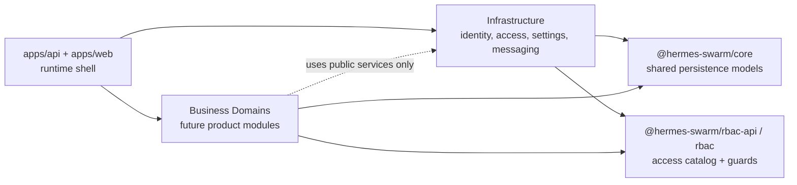

# 基础设施与业务接入边界

更新日期：2026-07-17

当前系统没有独立的“管理后台”。用户明面上看到的是同一套产品界面，账号、组织、权限、平台配置、邮件、通知和登录会话等能力属于平台基础设施；Ticket 与 Conversation 属于 Support 业务域。

## 目标边界

## 后端目录规则

| Area | 路径 | 职责 |
| --- | --- | --- |
| Runtime bootstrap | `apps/api/src/app.module.ts`, `main.ts` | 启动、全局配置、数据库、Redis、OpenAPI、全局 guard |
| Infrastructure aggregate | `apps/api/src/infrastructure` | 装配基础设施模块，提供系统初始化/bootstrap |
| Infrastructure modules | `apps/api/src/infrastructure/<module>` | 账号、组织、权限、配置、消息等平台能力 |
| Shared packages | `packages/core`, `packages/rbac-api`, `packages/rbac` | 共享持久化实体、设置定义、权限契约、Nest Access 运行时 |
| Business modules | `apps/api/src/domains/<domain>` or dedicated package | 业务域控制器、服务与任务；不能直接塞进基础设施目录 |
| Support domain | `apps/api/src/domains/support` | Ticket、Conversation、相关访问解析与归档任务 |

后端 API URL 目前仍保持 `/api/admin/**`，这是兼容现有前端和接口调用的传输路径；代码归属不再使用 `admin` 目录表达系统边界。

业务模块接入时应该：

- 自己声明 `@AccessResource` / `@AccessOperation`，让权限目录自动出现。
- 通过基础设施公开服务读取当前用户、组织、配置和权限，不复制平台成员/角色逻辑。
- 不把业务表、业务控制器、业务页面放进 `settings`、`organizations`、`platform-*` 等基础设施目录。

## 前端目录规则

| Area | 路径 | 职责 |
| --- | --- | --- |
| Runtime shell | `apps/web/components/admin-shell.tsx`, `app/layout.tsx` | 会话、主题、应用外壳 |
| Infrastructure pages | `apps/web/app/settings/**` | 个人、组织、平台基础设施配置 |
| Infrastructure navigation | `apps/web/components/infrastructure-navigation.ts` | 从共享页面访问目录生成基础设施导航 |
| Access helpers | `apps/web/hooks/use-permission.ts`, `components/access-gate.tsx` | 页面和组件访问判断 |
| Business pages | `apps/web/app/(console)/(domains)/<domain>` | 复用 Console shell 且不改变 URL 的业务产品页面 |

`/settings/**` 只是当前已有 URL，不代表所有能力都属于“设置模块”。未来业务页面不应继续挂在 `/settings` 下，除非它确实是在配置基础设施。

## 依赖方向

允许：

- `business -> infrastructure public service`
- `business -> @hermes-swarm/core`
- `business -> @hermes-swarm/rbac-api`
- `api/web runtime -> infrastructure aggregate`

不允许：

- `infrastructure -> business`
- `business` 直接修改基础设施内部表语义来表达业务状态
- 前端业务页面维护自己的固定角色判断
- 业务模块复用 `/settings/platform` 或 `/settings/organization` 作为业务入口

## 当前已落地的结构变化

- `apps/api/src/infrastructure` 成为基础设施命名空间与聚合层。
- 原 admin 聚合层的系统初始化职责迁移为 `InfrastructureModule/InfrastructureBootstrapController`。
- `apps/api/src/domains/support` 承载 Ticket、Conversation 和归档任务；通用 Tenant Job 运行时留在 `common/jobs`。
- `packages/core/src/support` 承载 Support 业务实体，通知实体不再混放 Ticket/Conversation。
- `apps/web/app/(console)/(domains)` 成为前端业务页面接入槽位；`/tickets` URL 与 Console shell 保持不变。
- 前端新增 `components/infrastructure-navigation.ts`，旧 `settings-navigation.ts` 仅作为兼容 re-export。
- 页面权限仍由 `@hermes-swarm/rbac-api` 的 page access definition 统一生成，并进入后端权限目录。
