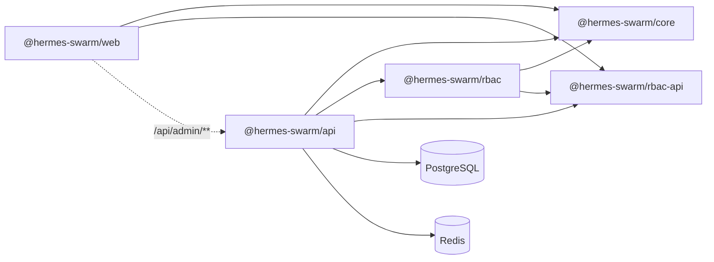
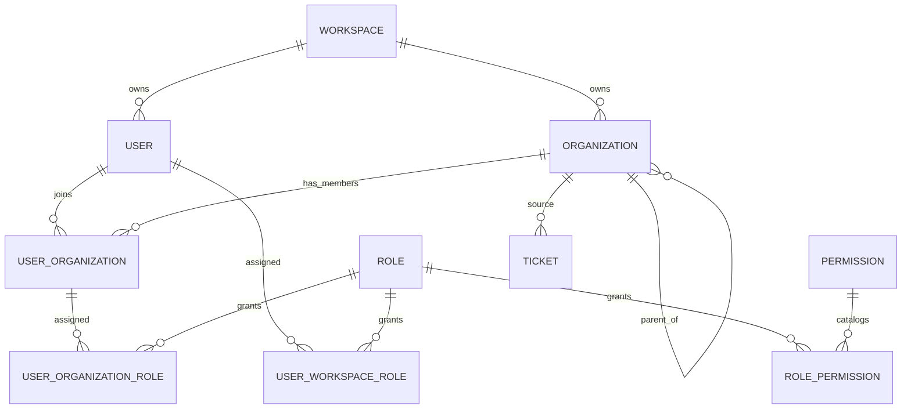

# 当前模块与引用图

更新日期：2026-07-22

## Nx 项目



| Project | Responsibility |
| --- | --- |
| `@hermes-swarm/core` | Shared persistence models: identity、settings、mail、notifications、support |
| `@hermes-swarm/rbac-api` | Permission IDs、page access catalog、shared DTO |
| `@hermes-swarm/rbac` | Nest access decorators、guard、catalog、audit runtime |
| `@hermes-swarm/api` | Nest runtime、认证工作空间上下文、显式 `workspace_id` 数据访问、infrastructure 与 business domains |
| `@hermes-swarm/web` | Next.js Platform console、Workspace console 与 business pages |

## 身份与数据关系



Platform identity uses separate `platform_users`、`platform_roles`、`platform_role_permissions` tables and does not join Workspace User tables.

## API modules

| Module | Boundary |
| --- | --- |
| Auth | Separate Platform/Workspace login, refresh, session and `/auth/me` |
| Workspaces | Applications, approval, status, root-organization onboarding, unified role library |
| Organizations | Lightweight tree CRUD and ancestry validation |
| Memberships | User ↔ Organization membership and exact Organization role assignments |
| Users | Workspace-local users, status, self profile and Workspace role assignments |
| Invite | One workspace invite with multiple Organization assignments |
| Settings | Platform default → Workspace override |
| Mail | Platform public mail plus Workspace SMTP/templates/logs |
| Support domain | `domains/support` 中的 Ticket/Conversation 与 source Organization access filtering |
| Notifications/Realtime | Workspace + recipient User, workspace-namespaced delivery |
| Integrations | User-owned personal API Token with live Token ∩ User permission checks |
| Jobs/Audit | 通用 Workspace job runtime 位于 `common/jobs`；业务 job 与对应 domain 共置 |

Removed modules: Departments, Department dispatch, Organization groups, Organization settings and notification destinations.

## Scope and access

Permission IDs remain:

```text
{entity}.{purpose}.{operation}:{scope}
page.{pageKey}.access:{scope}
```

Valid Workspace-facing scopes are `workspace | organization | own`. Platform permissions are queried only through Platform APIs. Organization Role does not inherit across the tree; Ticket ancestor visibility is a separate data-access rule.

The web client never sends Workspace or implicit scope headers. Workspace comes from the session; Organization identifiers are explicit route/query/body values. `OrganizationContextProvider` only maintains the active Organization UI selection and abort epoch.

## Frontend routes

Platform control plane:

- `/platform/workspaces`
- `/platform/settings`
- `/platform/email-templates`

Workspace settings:

- `/settings/workspace`
- `/settings/organizations`
- `/settings/users`
- `/settings/invites`
- `/settings/email-templates`
- `/settings/custom-smtp`
- `/settings/integrations`
- `/settings/workspace-access`
- `/settings/organization`
- `/settings/organization/members`
- `/settings/organization/roles`

“全部组织”显示工作空间治理；具体组织显示资料、成员和该组织独立的角色权限。组织角色不跨组织或沿树继承。

Business routes:

- `/tickets` → `app/(console)/(domains)/tickets`

## 源码目录边界

```text
apps/api/src/
├── common/                  # runtime primitives: config, DB context, Redis, generic jobs
├── infrastructure/          # identity, access, settings, mail, notifications
└── domains/
    └── support/             # tickets, conversations, domain jobs

apps/web/app/(console)/
├── settings/                # infrastructure configuration
└── (domains)/
    └── tickets/             # business route; URL remains /tickets

packages/core/src/
├── identity/                # workspace identity persistence models
├── mail/
├── notifications/          # recipient notifications only
├── settings/
└── support/                 # ticket and conversation persistence models
```

## Database baseline

`WorkspaceModelBaseline2026071500001` remains the initial migration. Hermes uses one PostgreSQL URL and one TypeORM DataSource. Authentication establishes a trusted workspace context; workspace-owned reads, updates and deletes must explicitly include `workspace_id`, while platform cross-workspace access remains protected by Platform RBAC. PostgreSQL RLS, per-request GUCs and dedicated RLS roles are not part of the active architecture.

## Verification

```powershell
pnpm nx show projects --json
pnpm nx run-many -t typecheck test build --skipNxCache
pnpm nx run @hermes-swarm/api:e2e --skipNxCache
pnpm nx run @hermes-swarm/web:e2e --skipNxCache
pnpm nx run @hermes-swarm/api:openapi:generate
```
