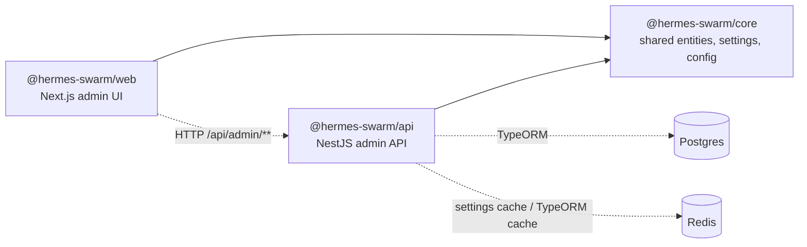
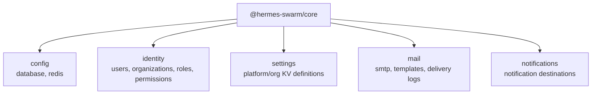
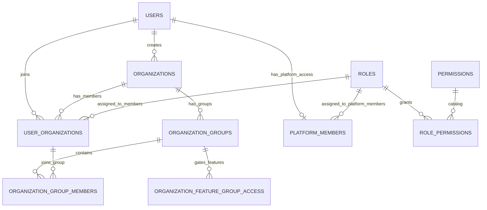
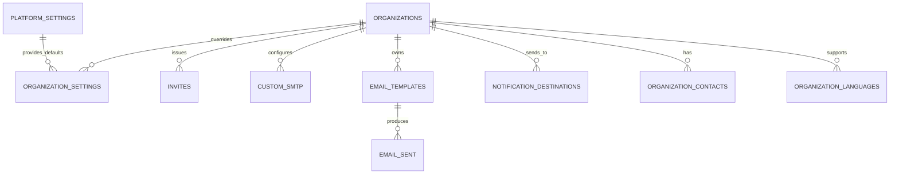
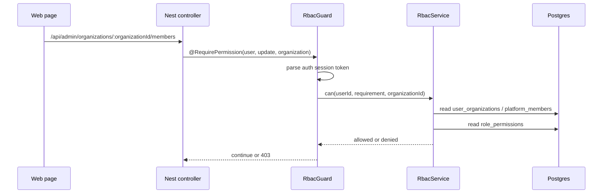
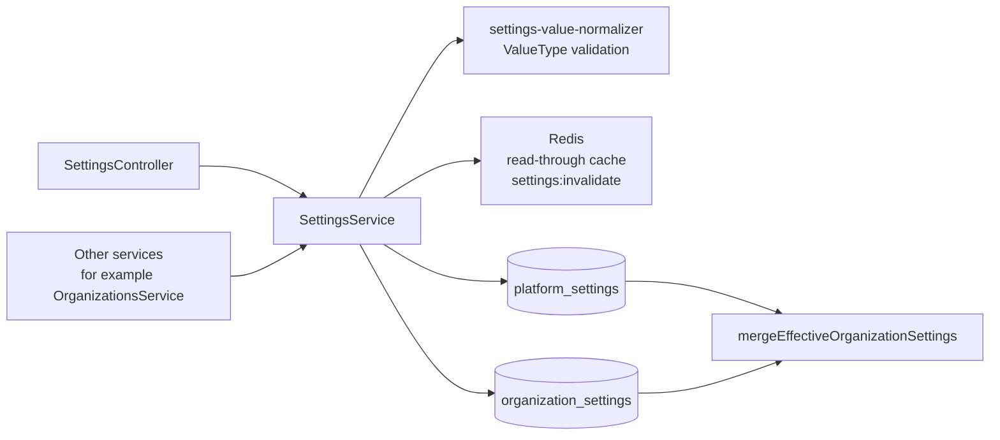
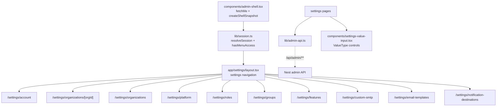

# 当前模块与引用图

更新日期：2026-06-30

这份文档记录当前代码实现，不是重构计划。项目级依赖来自 `pnpm nx graph --print`，后端模块来自 `apps/api/src/**/*.module.ts` 与 controller 路由，前端入口来自 `apps/web/app/settings/**`、`apps/web/lib/admin-api.ts` 和 `apps/web/lib/session.ts`。

## 1. Nx 项目图

当前 workspace 只有三个项目：`@hermes-swarm/core`、`@hermes-swarm/api`、`@hermes-swarm/web`。



代码级静态引用只有两条：

| Source | Target | Type |
| --- | --- | --- |
| `@hermes-swarm/api` | `@hermes-swarm/core` | static |
| `@hermes-swarm/web` | `@hermes-swarm/core` | static |

## 2. Core 包边界

`packages/core/src/index.ts` 只对外暴露五类共享能力：



主要 subpath exports：

| Export | 用途 |
| --- | --- |
| `@hermes-swarm/core` | 聚合导出 |
| `@hermes-swarm/core/identity` | 身份、组织、角色、权限实体与权限常量 |
| `@hermes-swarm/core/identity/permissions` | `DEFAULT_PERMISSION_KEYS`、角色默认权限、角色排序 |
| `@hermes-swarm/core/identity/entities` | TypeORM identity entities |
| `@hermes-swarm/core/settings` | ValueType、平台配置定义、有效配置合并 |
| `@hermes-swarm/core/settings/entities` | `PlatformSetting` |
| `@hermes-swarm/core/config/database` | Postgres URL |
| `@hermes-swarm/core/config/redis` | Redis URL 与 TypeORM Redis cache options |
| `@hermes-swarm/core/mail` | SMTP、模板、邮件日志实体 |
| `@hermes-swarm/core/notifications` | 通知目标实体 |

## 3. 后端 Nest 模块图

`AppModule` 装配基础设施、全局 RBAC guard、功能访问 guard 和 admin 业务模块。

```mermaid
flowchart TB
  App["AppModule"] --> Database["DatabaseModule<br/>TypeORM Postgres<br/>optional Redis query cache"]
  App --> Health["HealthModule<br/>GET /api/health"]
  App --> Rbac["RbacModule<br/>APP_GUARD + RbacService"]
  App --> Admin["AdminModule<br/>/api/admin bootstrap + onboarding"]

  Admin --> Auth["AuthModule<br/>login, me, authenticated"]
  Admin --> Users["UsersModule<br/>global user account"]
  Admin --> Organizations["OrganizationsModule<br/>organization CRUD + org roles"]
  Admin --> Memberships["MembershipsModule<br/>user_organizations"]
  Admin --> Settings["SettingsModule<br/>platform/org settings"]
  Admin --> Groups["GroupsModule<br/>organization groups"]
  Admin --> FeatureAccess["FeatureAccessModule<br/>APP_GUARD + organization feature switches"]
  Admin --> Invite["InviteModule<br/>organization invites"]
  Admin --> Files["FilesModule<br/>admin file upload/download"]
  Admin --> Mail["MailModule<br/>SMTP, templates, logs"]
  Admin --> PlatformMembers["PlatformMembersModule<br/>platform_members"]
  Admin --> PlatformRoles["PlatformRolesModule<br/>platform roles + permissions"]
  Admin --> Notifications["NotificationsModule<br/>notification destinations"]
  Admin --> PasswordReset["PasswordResetModule<br/>password reset"]

  Organizations --> Settings
  FeatureAccess --> Settings
  Rbac --> IdentityEntities["@hermes-swarm/core identity entities"]
  Settings --> SettingsEntities["@hermes-swarm/core settings entities"]
  Mail --> MailEntities["@hermes-swarm/core mail entities"]
  Notifications --> NotificationEntities["@hermes-swarm/core notification entities"]
```



模块责任边界：

| Module | 主要职责 | 关键实体 |
| --- | --- | --- |
| `AuthModule` | 登录、解析当前用户、返回 memberships/platformMembership/permissions | `User`, `UserOrganization`, `PlatformMember`, `RolePermission` |
| `UsersModule` | 全局用户账号、个人资料、密码、语言偏好、平台用户管理 | `User`, `PlatformMember`, `Role` |
| `OrganizationsModule` | 组织 CRUD、组织角色 CRUD、组织角色权限矩阵 | `Organization`, `Role`, `RolePermission`, `Permission`, `UserOrganization` |
| `MembershipsModule` | 组织成员列表、创建、角色/显示名/状态修改、删除 | `User`, `Organization`, `Role`, `UserOrganization` |
| `GroupsModule` | 组织用户组 CRUD、用户组成员维护 | `OrganizationGroup`, `OrganizationGroupMember`, `UserOrganization` |
| `FeatureAccessModule` | `@RequireFeature` 全局守卫，按组织 feature 开关控制接口可用性 | `OrganizationSetting` |
| `PlatformMembersModule` | 平台成员管理 | `PlatformMember`, `User`, `Role` |
| `PlatformRolesModule` | 平台角色和平台角色权限矩阵 | `Role`, `Permission`, `RolePermission` |
| `RbacModule` | 全局 `@RequirePermission` 权限守卫，CASL ability 构建，权限目录初始化 | `Permission`, `PlatformMember`, `UserOrganization`, `RolePermission` |
| `SettingsModule` | 平台/组织 KV 设置、ValueType 校验、Redis cache/invalidation | `PlatformSetting`, `OrganizationSetting` |
| `InviteModule` | 组织邀请、重发、撤销、接受邀请后创建组织成员关系 | `Invite`, `User`, `UserOrganization`, `Role` |
| `MailModule` | 组织 SMTP、邮件模板、发送日志 | `CustomSmtp`, `EmailTemplate`, `EmailLog` |
| `NotificationsModule` | 组织通知目标与目标类型 | `NotificationDestination` |
| `FilesModule` | 管理端文件上传和访问 | filesystem |
| `PasswordResetModule` | 请求重置密码、执行重置 | `PasswordReset`, `User` |

## 4. 数据实体关系

核心身份与权限模型：



组织扩展能力：



实体清单：

| Area | Tables |
| --- | --- |
| Identity | `users`, `organizations`, `user_organizations`, `platform_members`, `organization_groups`, `organization_group_members` |
| RBAC | `roles`, `permissions`, `role_permissions` |
| Settings | `platform_settings`, `organization_settings` |
| Invite/Auth | `invites`, `password_reset`, `email_verifications` |
| Organization profile | `organization_contacts`, `organization_languages` |
| Mail | `custom_smtp`, `email_templates`, `email_sent` |
| Notifications | `notification_destinations` |

## 5. 权限引用图

所有需要权限的 admin 业务接口使用 `@RequirePermission({ entity, action, scope })`。`RbacGuard` 从 bearer token 解析 `userId`，再按 route metadata 和 `organizationId` path param 调用 `RbacService.can(...)`。



权限 key 格式固定为：

```text
{entity}:{action}:{scope}
```

当前 action 和 scope：

| Dimension | Values |
| --- | --- |
| action | `create`, `read`, `update`, `delete` |
| scope | `platform`, `organization`, `own` |

当前默认权限实体包括：`user`、`organization`、`role`、`group`、`setting`、`invite`、`mail`、`notification`。

功能访问 guard 在 RBAC 之后执行。`@RequireFeature(featureKey)` 只读取组织 feature 开关；开关为 `"true"` 时保持现有 RBAC 行为，未开启时返回 `403 功能未启用`。

## 6. 设置与 Redis 引用图

平台设置和组织设置继续使用 KV 结构，并带 `valueType`、`valueOptions`。后端服务读取设置时应经过 `SettingsService`，以便统一走缓存、校验和 secret masking。



ValueType：

| Type | 存储规则 |
| --- | --- |
| `string` | 普通字符串 |
| `boolean` | 存 `"true"` 或 `"false"` |
| `number` | 有限数字，存规范数字字符串 |
| `json` | 对象/数组或可解析 JSON，存规范 JSON 字符串 |
| `enum` | 必须带非空 `valueOptions`，值必须属于选项 |
| `secret` | 保存原文，API 返回与前端处理时显示 `********`，提交 mask 时保留旧值 |

## 7. API 路由归属

| Route family | Module | Permission scope |
| --- | --- | --- |
| `GET /api/health` | `HealthModule` | public |
| `GET /api/admin/bootstrap` | `AdminModule` | public |
| `POST /api/admin/onboarding` | `AdminModule` | public first-run |
| `POST /api/admin/auth/login` | `AuthModule` | public |
| `GET /api/admin/auth/authenticated` | `AuthModule` | token check |
| `GET /api/admin/auth/me` | `AuthModule` | token principal |
| `/api/admin/users` | `UsersModule` | `user:*:platform` |
| `/api/admin/users/:userId` | `UsersModule` | `user:update:own` |
| `/api/admin/platform/members` | `PlatformMembersModule` | `user:*:platform` |
| `/api/admin/platform/roles` | `PlatformRolesModule` | `role:*:platform` |
| `/api/admin/platform/settings` | `SettingsModule` | `setting:*:platform` |
| `/api/admin/organizations` | `OrganizationsModule` | platform list/create/delete, org read/update |
| `/api/admin/organizations/:organizationId/members` | `MembershipsModule` | `user:*:organization` |
| `/api/admin/organizations/:organizationId/groups` | `GroupsModule` | `group:*:organization` |
| `/api/admin/organizations/:organizationId/groups/:groupId/members` | `GroupsModule` | `group:*:organization` |
| `/api/admin/organizations/:organizationId/roles` | `OrganizationsModule` | `role:*:organization` |
| `/api/admin/organizations/:organizationId/settings` | `SettingsModule` | `setting:*:organization` |
| `/api/admin/organizations/:organizationId/invites` | `InviteModule` | `invite:*:organization` |
| `/api/admin/invites/validate` | `InviteModule` | public invite validation |
| `/api/admin/invites/accept` | `InviteModule` | public invite acceptance |
| `/api/admin/organizations/:organizationId/mail/*` | `MailModule` | `mail:*:organization` |
| `/api/admin/organizations/:organizationId/notification-destinations/*` | `NotificationsModule` | `notification:*:organization` |
| `/api/admin/files/*` | `FilesModule` | authenticated upload/download surface |
| `/api/admin/auth/request-password` | `PasswordResetModule` | public |
| `/api/admin/auth/reset-password` | `PasswordResetModule` | public |

## 8. 前端引用图

前端 settings 区域以 `AdminShell` 的 session snapshot 为中心。登录后 `fetchMe` 返回全局 user、组织 memberships、平台 membership、权限 key 列表；页面通过 `hasMenuAccess` 将菜单项映射到实体权限。



Settings 页面职责：

| Page | Purpose | Main API wrappers |
| --- | --- | --- |
| `/settings/account` | 个人资料、密码、语言偏好 | `updateUser`, `updateUserPassword`, `updateUserPreferredLanguage` |
| `/settings/organizations` | 平台组织列表与组织创建 | `listOrganizations`, `createOrganization` |
| `/settings/organizations/[orgId]` | 组织详情、成员、组织设置、组织角色 | `getOrganization`, `listOrganizationMembers`, `listOrganizationSettingsForOrganization`, `listOrganizationRoles` |
| `/settings/platform` | 平台默认配置、平台成员、平台角色、组织概览 | `listSystemSettings`, `saveSystemSettings`, `listPlatformMembers`, `listPlatformRoles` |
| `/settings/roles` | 当前组织角色与权限矩阵 | `listOrganizationRoles`, `replaceOrganizationRolePermissions` |
| `/settings/groups` | 当前组织用户组与成员维护 | `listOrganizationGroups`, `replaceOrganizationGroupMembers` |
| `/settings/features` | 组织 feature KV 开关 | `listOrganizationSettings`, `saveOrganizationSettings` |
| `/settings/custom-smtp` | 组织 SMTP | `getSmtpConfig`, `saveSmtpConfig`, `validateSmtpConfig` |
| `/settings/email-templates` | 组织邮件模板 | `listEmailTemplates`, `createEmailTemplate`, `updateEmailTemplate`, `deleteEmailTemplate` |
| `/settings/notification-destinations` | 组织通知目标 | `listNotificationDestinations`, `listNotificationDestinationTypes` |

导航权限映射：

| Menu key | Permission entity/scope |
| --- | --- |
| `account` | `user:*:own` |
| `organization` | `organization:*:organization` |
| `custom-smtp` | `mail:*:organization` |
| `email-templates` | `mail:*:organization` |
| `notification-destinations` | `notification:*:organization` |
| `features` | `setting:*:organization` |
| `groups` | `group:*:organization` |
| `roles` | `role:*:organization` |
| `platform` | `setting:*:platform` |
| `organizations` | `organization:*:platform` |

## 9. 已移除的旧入口

当前实现中不再存在这些模块或页面：

| Removed area | Current replacement |
| --- | --- |
| old centralized organization service | `UsersModule`, `OrganizationsModule`, `MembershipsModule`, `RbacModule`, `SettingsModule` |
| configurable admin navigation records | static settings navigation + entity permission mapping |
| organization tags feature | removed |
| `/settings/menus` route | removed |
| `/settings/tags` route | removed |
| frontend wrappers for `/admin/invites`, `/admin/roles/:roleId/permissions`, `/admin/organizations/:id/users` | removed; use organization-scoped invites, platform/org roles, and `/members` |

## 10. 快速验证命令

```powershell
pnpm nx show projects --json
pnpm nx graph --print
pnpm verify:refactor
pnpm nx run @hermes-swarm/core:build --skip-nx-cache
pnpm nx run @hermes-swarm/api:typecheck --skip-nx-cache
pnpm nx run @hermes-swarm/web:typecheck --skip-nx-cache
```
