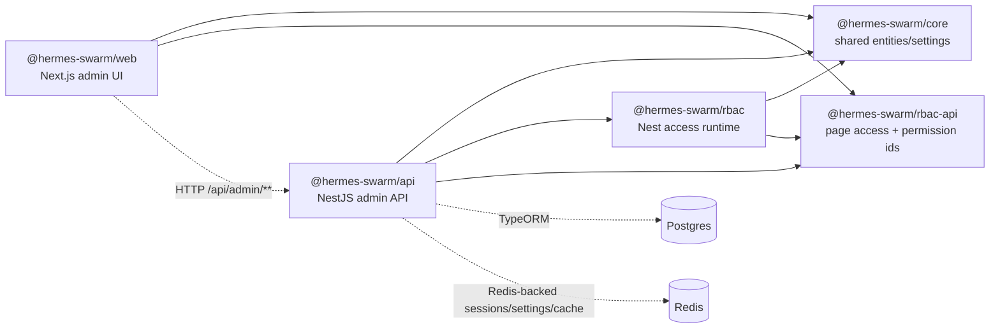
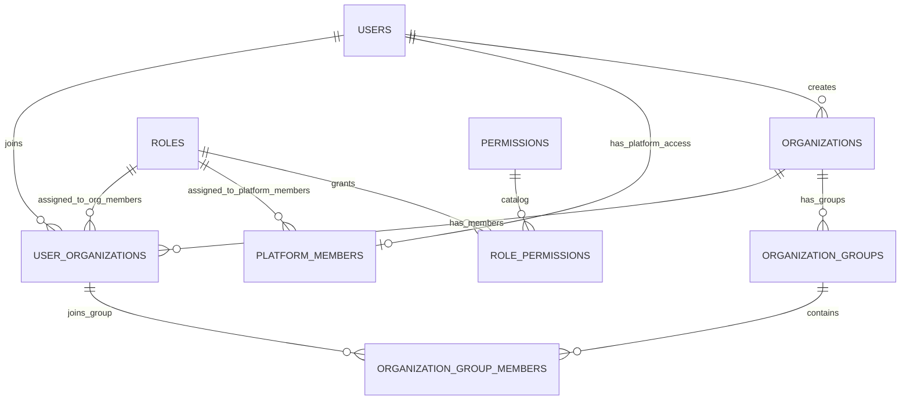
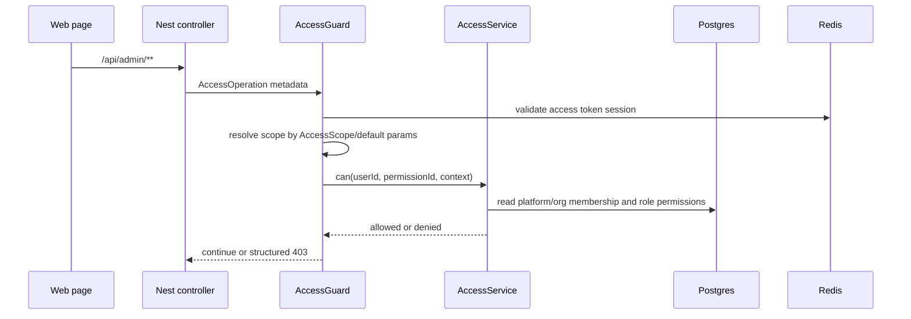
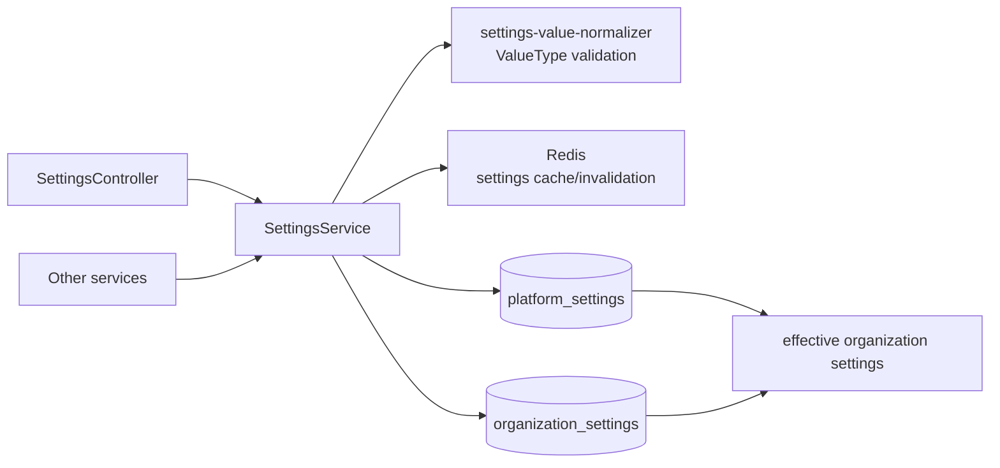
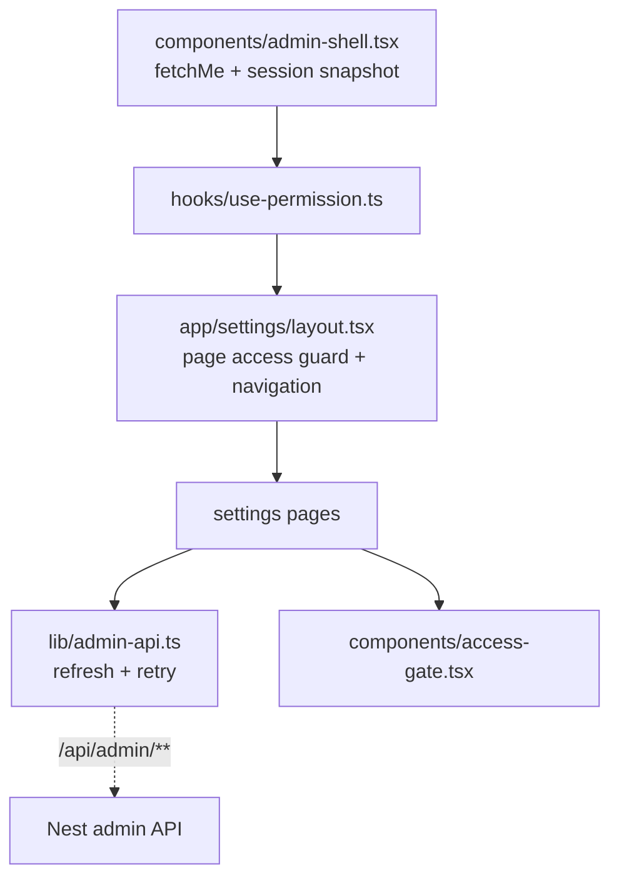

# 当前模块与引用图

更新日期：2026-07-03

这份文档记录当前代码实现，不是重构计划。项目级依赖来自 `pnpm nx graph --print`，后端模块来自 `apps/api/src/**/*.module.ts` 与 controller 路由，前端入口来自 `apps/web/app/settings/**`、`apps/web/lib/admin-api.ts`、`apps/web/lib/session.ts` 和 `apps/web/hooks/use-permission.ts`。

## 1. Nx 项目图

当前 workspace 有五个项目：

- `@hermes-swarm/core`：框架无关的业务实体、配置定义、设置类型。
- `@hermes-swarm/rbac-api`：框架无关的权限 ID、页面访问目录、权限目录 DTO。
- `@hermes-swarm/rbac`：Nest 侧 Access 装饰器、Guard、Catalog 同步、权限目录接口。
- `@hermes-swarm/api`：NestJS admin API。
- `@hermes-swarm/web`：Next.js admin UI。



代码级静态引用：

| Source | Target | Type |
| --- | --- | --- |
| `@hermes-swarm/rbac` | `@hermes-swarm/core` | static |
| `@hermes-swarm/rbac` | `@hermes-swarm/rbac-api` | static |
| `@hermes-swarm/api` | `@hermes-swarm/core` | static |
| `@hermes-swarm/api` | `@hermes-swarm/rbac` | static |
| `@hermes-swarm/api` | `@hermes-swarm/rbac-api` | static |
| `@hermes-swarm/web` | `@hermes-swarm/core` | static |
| `@hermes-swarm/web` | `@hermes-swarm/rbac-api` | static |

## 2. 包边界

`@hermes-swarm/core` 只保存跨端共享业务模型与基础实体；不放 Nest、React 或权限运行时逻辑。

| Export | 用途 |
| --- | --- |
| `@hermes-swarm/core` | 聚合导出 |
| `@hermes-swarm/core/identity` | 用户、组织、角色、权限实体与 `platform-admin` 固定角色名 |
| `@hermes-swarm/core/identity/entities` | TypeORM identity entities |
| `@hermes-swarm/core/settings` | ValueType、平台配置定义、有效配置合并 |
| `@hermes-swarm/core/settings/entities` | `PlatformSetting`, `OrganizationSetting` |
| `@hermes-swarm/core/mail` | SMTP、模板、邮件日志实体 |
| `@hermes-swarm/core/notifications` | 通知目标实体 |

`@hermes-swarm/rbac-api` 是前后端共享的 Access 契约。

| Export | 用途 |
| --- | --- |
| page access definitions | 设置页、平台页、组织页的页面访问目录 |
| permission key helpers | `entity.purpose.operation:scope` 与 `page.<key>.access:<scope>` 生成器 |
| catalog DTO types | 权限树接口的共享 DTO 类型 |

`@hermes-swarm/rbac` 是 Nest 运行时包。

| Runtime | 用途 |
| --- | --- |
| `AccessResource` / `AccessOperation` / `AccessScope` | Controller 权限声明 |
| `AccessGuard` | 全局接口权限校验，返回结构化 403 |
| `AccessCatalogService` | 扫描 Controller 元数据和页面目录，同步 `permissions` 表 |
| `AccessService` | 基于当前用户、角色、权限、scope 判断访问 |
| `AccessAuditInterceptor` | 审计扩展点，目前保留 no-op 记录点 |

旧的 `PermissionResource` / `PermissionOperation` 仍作为兼容 alias 保留在 `@hermes-swarm/rbac`，业务控制器统一使用新的 `Access*` 名称。

## 3. 后端模块图

```mermaid
flowchart TB
  App["AppModule"] --> Config["ConfigModule<br/>env loading + validation"]
  App --> Database["DatabaseModule<br/>TypeORM Postgres"]
  App --> Redis["RedisModule<br/>shared RedisService"]
  App --> Health["HealthModule<br/>GET /api/health"]
  App --> Access["AccessNestModule / RbacModule<br/>APP_GUARD + catalog sync"]
  App --> Admin["AdminModule<br/>/api/admin bootstrap + onboarding"]

  Admin --> Auth["AuthModule<br/>login, refresh, logout, sessions, me"]
  Admin --> Users["UsersModule<br/>global users + account"]
  Admin --> Organizations["OrganizationsModule<br/>organization CRUD + org roles"]
  Admin --> Memberships["MembershipsModule<br/>organization members"]
  Admin --> Groups["GroupsModule<br/>organization groups as labels"]
  Admin --> Settings["SettingsModule<br/>platform/org settings + ValueType"]
  Admin --> Invite["InviteModule<br/>organization invites"]
  Admin --> Mail["MailModule<br/>SMTP, templates, logs"]
  Admin --> PlatformMembers["PlatformMembersModule<br/>platform operators"]
  Admin --> PlatformRoles["PlatformRolesModule<br/>platform roles + permissions"]
  Admin --> Notifications["NotificationsModule<br/>notification destinations"]
  Admin --> PasswordReset["PasswordResetModule<br/>password reset"]
  Admin --> Files["FilesModule<br/>admin file upload/download"]
```



模块责任边界：

| Module | 主要职责 | 关键实体 |
| --- | --- | --- |
| `AuthModule` | 登录、refresh token、Redis session、设备列表、登出、当前用户快照 | `User`, `PlatformMember`, `UserOrganization`, Redis session |
| `UsersModule` | 全局用户账号、个人资料、密码、语言偏好、用户搜索 | `User` |
| `OrganizationsModule` | 组织 CRUD、组织详情、组织角色 CRUD、组织角色权限 | `Organization`, `Role`, `RolePermission`, `Permission` |
| `MembershipsModule` | 组织成员列表、创建、角色/显示名/状态修改、删除 | `UserOrganization`, `User`, `Role` |
| `GroupsModule` | 组织用户组 CRUD、用户组成员维护；用户组只做分类，不参与权限控制 | `OrganizationGroup`, `OrganizationGroupMember` |
| `SettingsModule` | 平台/组织 KV 设置、ValueType 校验、secret masking、Redis cache/invalidation | `PlatformSetting`, `OrganizationSetting` |
| `PlatformMembersModule` | 平台运营人员管理 | `PlatformMember`, `User`, `Role` |
| `PlatformRolesModule` | 平台角色和平台角色权限矩阵 | `Role`, `Permission`, `RolePermission` |
| `RbacModule` / `AccessNestModule` | 全局 Access guard、权限目录生成、页面访问权限同步 | `Permission`, `RolePermission` |
| `MailModule` | 组织 SMTP、邮件模板、发送日志 | `CustomSmtp`, `EmailTemplate`, `EmailLog` |
| `NotificationsModule` | 组织通知目标与目标类型 | `NotificationDestination` |

## 4. 数据实体关系



扩展实体：

| Area | Tables |
| --- | --- |
| Identity | `users`, `organizations`, `user_organizations`, `platform_members`, `organization_groups`, `organization_group_members` |
| RBAC | `roles`, `permissions`, `role_permissions` |
| Settings | `platform_settings`, `organization_settings` |
| Auth | Redis `auth:session:*`, Redis `auth:user_sessions:*`, `password_reset`, `email_verifications` |
| Invite | `invites` |
| Organization profile | `organization_contacts`, `organization_languages` |
| Mail | `custom_smtp`, `email_templates`, `email_sent` |
| Notifications | `notification_destinations` |

## 5. Access / RBAC 权限模型

接口权限 ID：

```text
{entity}.{purpose}.{operation}:{scope}
```

页面访问权限 ID：

```text
page.{pageKey}.access:{scope}
```

scope：

| Scope | 说明 |
| --- | --- |
| `platform` | 平台范围，只检查平台成员角色权限 |
| `organization` | 组织范围，需要组织上下文；平台管理员可兜底通过 |
| `own` | 当前用户个人范围，需要目标用户解析匹配当前用户 |

权限来源：

| Source | 来源 |
| --- | --- |
| `controller` | `AccessResource` + `AccessOperation` 扫描结果 |
| `navigation` | `@hermes-swarm/rbac-api` 页面访问定义 |
| `manual` | 保留给后续手动权限或外部扩展 |

权限校验流程：



缺权限响应包含 `RBAC_PERMISSION_DENIED`、缺失 permission id、label、description、scope、entity、purpose、operation，前端可直接展示 message。

## 6. Auth / Session

当前认证为短期 access token + Redis session + HttpOnly refresh token：

| Token / State | 存储 | 用途 |
| --- | --- | --- |
| access token | 前端运行态/session 文件，短期有效 | 普通 API 请求 `Authorization: Bearer` |
| refresh token | HttpOnly cookie | access token 过期后换新 |
| session | Redis | 登录设备、手动登出、撤销、过期事实源 |

前端请求封装在 `apps/web/lib/admin-api.ts`：遇到 401 会调用 `/api/admin/auth/refresh` 一次，成功后重试原请求；refresh 失败则清理 session 并回到登录页。

个人登录设备页面为 `/settings/sessions`，展示当前、过期和已撤销设备。

## 7. 设置与 Redis 引用图

平台设置和组织设置继续使用 KV 结构，并带 `valueType`、`valueOptions`。后端服务读取设置时应经过 `SettingsService`，以便统一走缓存、校验和 secret masking。



ValueType：

| Type | 存储规则 |
| --- | --- |
| `string` | 普通字符串 |
| `boolean` | 存 `"true"` 或 `"false"` |
| `number` | 有限数字，存规范数字字符串 |
| `json` | 对象/数组或可解析 JSON，存规范 JSON 字符串 |
| `enum` | 必须带非空 `valueOptions`，值必须属于选项 |
| `secret` | 保存原文，API 返回与前端处理时显示 mask，提交 mask 时保留旧值 |

## 8. API 与 OpenAPI

Admin API 保持在 `/api/admin/**` 下，健康检查在 `/api/health`。

Swagger 接入：

| Endpoint / Script | 用途 |
| --- | --- |
| `GET /api/docs` | 在线 Swagger UI |
| `GET /api/openapi.json` | 在线 OpenAPI JSON |
| `pnpm openapi:generate` | 生成离线 `docs/api/openapi.admin.json` |

## 9. 前端访问控制

前端以 `AdminShell` 的 session snapshot 为中心。登录后 `fetchMe` 返回 user、memberships、platformMembership、permissions。菜单、页面守卫和组件显隐统一使用 `usePermission()` / `AccessGate`。



约束：

- 页面可见性和直接访问控制基于 `page.*.access:*` 权限。
- 普通 UI 动作基于具体接口权限，例如 `setting.platform_config.update_basic:platform`。
- 除 `platform-admin` 种子角色外，前端不依赖固定角色名判断能力。
- 用户组只作为组织内用户分类，不参与权限控制。

## 10. 快速验证命令

```powershell
pnpm nx show projects --json
pnpm nx graph --print
pnpm verify:refactor
pnpm nx run-many -t typecheck
pnpm openapi:generate
```
