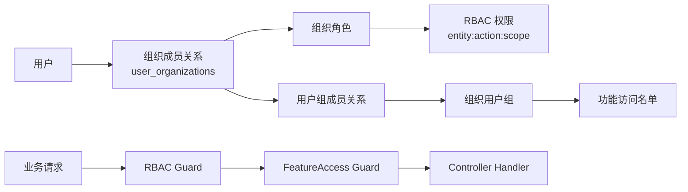

# 组织用户组与功能访问限制实现文档

状态：待实现方案  
范围：后端数据模型、RBAC 接入、功能访问守卫、前端设置页与验收计划  
目标：在组织角色之外提供用户组能力，用于限定某个组织功能的可访问人员

## 1. 背景与目标

当前角色体系解决的是“用户拥有什么操作能力”，例如是否可以管理成员、编辑配置、发送邀请。用户组要解决的是另一类问题：在一个功能已经开启、用户也具备基础权限的前提下，是否只允许组织内的一部分成员使用这个功能。

典型场景：

- 邀请功能只允许“HR 组”和“组织管理员”使用。
- 邮件功能只允许“运营组”访问 SMTP、模板和发送日志。
- 某些试验功能只开放给一个 beta 用户组。

本方案保留角色体系作为主权限系统，新增组织用户组作为功能访问 allow-list。用户组不授予权限，不替代角色，也不参与平台范围权限。

## 2. 设计原则

| 原则 | 说明 |
| --- | --- |
| 用户组只收窄访问 | 用户组不能让没有 RBAC 权限的人获得能力，只能限制已有权限的人是否可用某个功能 |
| 组织内隔离 | 用户组只属于单个组织，成员也必须来自同组织的 `user_organizations` |
| 空配置不限制 | 某个功能没有配置用户组时，维持现有 RBAC 行为 |
| 后端最终裁决 | 前端隐藏入口只是体验优化，接口必须由 guard 强制校验 |
| 能力型绕过 | 平台管理员和具备组织管理能力的用户可绕过 group allow-list，但仍必须通过 RBAC |
| 不复用旧语义 | 不复用历史 `groups` / `group_users` 表，避免和旧 schema 混淆 |

## 3. 权限模型关系

用户组独立于角色，但依赖角色完成基础授权。



判断顺序：

1. 用户必须登录。
2. `RbacGuard` 按 `@RequirePermission` 校验实体权限。
3. 如果接口声明了 `@RequireFeature(featureKey)`，再由 `FeatureAccessGuard` 校验功能开关与用户组 allow-list。
4. 只有两层都通过才进入业务 handler。

## 4. 数据模型

### 4.1 `organization_groups`

组织内用户组主表。

| 字段 | 类型 | 说明 |
| --- | --- | --- |
| `id` | uuid | 主键 |
| `organization_id` | uuid | 所属组织 |
| `name` | varchar(80) | 组织内唯一标识，建议 slug |
| `display_name` | varchar(120) | 展示名称 |
| `color` | varchar(40), nullable | 前端标识色 |
| `description` | text, nullable | 描述 |
| `created_by_user_id` | uuid, nullable | 创建人 |
| `created_at` / `updated_at` | timestamptz | 时间戳 |

约束：

- unique `(organization_id, name)`
- `organization_id` 级联删除
- `created_by_user_id` 删除用户时置空

### 4.2 `organization_group_members`

用户组成员表。成员来源必须是同组织的 `user_organizations`。

| 字段 | 类型 | 说明 |
| --- | --- | --- |
| `id` | uuid | 主键 |
| `organization_id` | uuid | 冗余组织 ID，便于隔离查询 |
| `group_id` | uuid | 用户组 ID |
| `membership_id` | uuid | `user_organizations.id` |
| `user_id` | uuid | 用户 ID，便于 guard 快速匹配 |
| `created_at` / `updated_at` | timestamptz | 时间戳 |

约束：

- unique `(group_id, membership_id)`
- `group_id`、`membership_id`、`user_id` 级联删除
- 写入时必须校验 membership 属于同一个 organization

### 4.3 `organization_feature_group_access`

功能与允许用户组的关联表。

| 字段 | 类型 | 说明 |
| --- | --- | --- |
| `id` | uuid | 主键 |
| `organization_id` | uuid | 所属组织 |
| `feature_key` | varchar(160) | 功能开关 key |
| `group_id` | uuid | 允许访问的用户组 |
| `created_at` / `updated_at` | timestamptz | 时间戳 |

约束：

- unique `(organization_id, feature_key, group_id)`
- `group_id` 级联删除
- `groupIds = []` 表示删除限制，恢复为“所有具备 RBAC 权限的人可用”

## 5. 初始化 SQL

如果当前阶段仍不引入完整 migration 框架，可以先提供幂等 SQL。`gen_random_uuid()` 需要 Postgres `pgcrypto` 扩展。

```sql
CREATE EXTENSION IF NOT EXISTS pgcrypto;

CREATE TABLE IF NOT EXISTS organization_groups (
  id uuid PRIMARY KEY DEFAULT gen_random_uuid(),
  organization_id uuid NOT NULL REFERENCES organizations(id) ON DELETE CASCADE,
  name varchar(80) NOT NULL,
  display_name varchar(120) NOT NULL,
  color varchar(40) NULL,
  description text NULL,
  created_by_user_id uuid NULL REFERENCES users(id) ON DELETE SET NULL,
  created_at timestamptz NOT NULL DEFAULT now(),
  updated_at timestamptz NOT NULL DEFAULT now(),
  CONSTRAINT uq_organization_groups_org_name UNIQUE (organization_id, name)
);

CREATE INDEX IF NOT EXISTS idx_organization_groups_organization_id
  ON organization_groups(organization_id);
CREATE INDEX IF NOT EXISTS idx_organization_groups_created_by_user_id
  ON organization_groups(created_by_user_id);

CREATE TABLE IF NOT EXISTS organization_group_members (
  id uuid PRIMARY KEY DEFAULT gen_random_uuid(),
  organization_id uuid NOT NULL REFERENCES organizations(id) ON DELETE CASCADE,
  group_id uuid NOT NULL REFERENCES organization_groups(id) ON DELETE CASCADE,
  membership_id uuid NOT NULL REFERENCES user_organizations(id) ON DELETE CASCADE,
  user_id uuid NOT NULL REFERENCES users(id) ON DELETE CASCADE,
  created_at timestamptz NOT NULL DEFAULT now(),
  updated_at timestamptz NOT NULL DEFAULT now(),
  CONSTRAINT uq_organization_group_members_group_membership UNIQUE (group_id, membership_id)
);

CREATE INDEX IF NOT EXISTS idx_organization_group_members_organization_id
  ON organization_group_members(organization_id);
CREATE INDEX IF NOT EXISTS idx_organization_group_members_group_id
  ON organization_group_members(group_id);
CREATE INDEX IF NOT EXISTS idx_organization_group_members_membership_id
  ON organization_group_members(membership_id);
CREATE INDEX IF NOT EXISTS idx_organization_group_members_user_id
  ON organization_group_members(user_id);

CREATE TABLE IF NOT EXISTS organization_feature_group_access (
  id uuid PRIMARY KEY DEFAULT gen_random_uuid(),
  organization_id uuid NOT NULL REFERENCES organizations(id) ON DELETE CASCADE,
  feature_key varchar(160) NOT NULL,
  group_id uuid NOT NULL REFERENCES organization_groups(id) ON DELETE CASCADE,
  created_at timestamptz NOT NULL DEFAULT now(),
  updated_at timestamptz NOT NULL DEFAULT now(),
  CONSTRAINT uq_organization_feature_group_access UNIQUE (organization_id, feature_key, group_id)
);

CREATE INDEX IF NOT EXISTS idx_organization_feature_group_access_organization_id
  ON organization_feature_group_access(organization_id);
CREATE INDEX IF NOT EXISTS idx_organization_feature_group_access_feature_key
  ON organization_feature_group_access(feature_key);
CREATE INDEX IF NOT EXISTS idx_organization_feature_group_access_group_id
  ON organization_feature_group_access(group_id);
```

## 6. Core 变更

新增实体：

- `packages/core/src/identity/entities/organization-group.entity.ts`
- `packages/core/src/identity/entities/organization-group-member.entity.ts`
- `packages/core/src/identity/entities/organization-feature-group-access.entity.ts`

导出位置：

- `packages/core/src/identity/entities/index.ts`
- `packages/core/src/identity/index.ts`
- `packages/core/src/index.ts`

权限目录新增：

```ts
"group:create:organization"
"group:read:organization"
"group:update:organization"
"group:delete:organization"
```

默认角色：

| 角色 | 默认 group 权限 |
| --- | --- |
| `platform-admin` | 全部 |
| `owner` | 全部组织范围 group 权限 |
| `admin` | 全部组织范围 group 权限 |
| `member` | 无 |
| `viewer` | 无 |

## 7. 后端模块设计

### 7.1 `GroupsModule`

挂载到 `AdminModule`，负责组织用户组 CRUD、成员维护和功能 allow-list 配置。

Controller base path：

```text
/api/admin/organizations/:organizationId
```

路由：

| Method | Route | Permission | 说明 |
| --- | --- | --- | --- |
| GET | `/groups` | `group:read:organization` | 用户组列表 |
| POST | `/groups` | `group:create:organization` | 创建用户组 |
| GET | `/groups/:groupId` | `group:read:organization` | 用户组详情 |
| PATCH | `/groups/:groupId` | `group:update:organization` | 更新用户组 |
| DELETE | `/groups/:groupId` | `group:delete:organization` | 删除用户组 |
| GET | `/groups/:groupId/members` | `group:read:organization` | 用户组成员 |
| PUT | `/groups/:groupId/members` | `group:update:organization` | 替换用户组成员 |
| GET | `/feature-access` | `setting:read:organization` | 功能访问名单 |
| PUT | `/feature-access` | `setting:update:organization` | 替换功能访问名单 |

### 7.2 Payload 与 DTO

创建/更新用户组：

```ts
type OrganizationGroupPayload = {
  name?: string;
  displayName?: string;
  color?: string | null;
  description?: string | null;
};
```

用户组 DTO：

```ts
type OrganizationGroupDto = {
  id: string;
  organizationId: string;
  name: string;
  displayName: string;
  color: string | null;
  description: string | null;
  createdByUserId: string | null;
  memberCount: number;
  createdAt: string;
  updatedAt: string;
};
```

替换成员：

```ts
type ReplaceOrganizationGroupMembersPayload = {
  membershipIds?: string[];
};
```

功能访问名单：

```ts
type OrganizationFeatureAccessDto = {
  featureKey: string;
  groupIds: string[];
  groups: OrganizationGroupBrief[];
};

type ReplaceOrganizationFeatureAccessPayload = {
  featureKey: string;
  groupIds: string[];
};
```

`groupIds: []` 的语义是删除该功能的所有用户组限制。

### 7.3 校验规则

用户组：

- `displayName` 必填。
- `name` 为空时由 `displayName` 生成 slug。
- `name` 在同组织内唯一。
- 删除用户组时，同时清理 `organization_group_members` 和 `organization_feature_group_access`。

成员：

- `membershipIds` 必须是数组。
- 所有 membership 必须属于当前 organization。
- 替换成员采用全量覆盖，便于前端用 checkbox/multi-select 保存。

功能访问：

- `featureKey` 必须来自 `FEATURE_SETTING_DEFINITIONS` 且 `scope === "organization"`。
- `groupIds` 必须全部属于当前 organization。
- 保存前删除旧记录，再插入新记录。
- 空列表表示不限制用户组。

## 8. FeatureAccess 设计

新增：

- `FeatureAccessModule`
- `FeatureAccessService`
- `FeatureAccessGuard`
- `@RequireFeature(featureKey)`

### 8.1 判断算法

```ts
async function isFeatureEnabledForUser(organizationId, featureKey, userId) {
  assertOrganizationFeatureKey(featureKey);

  const enabled = await settingsService.getOrganizationValue(
    organizationId,
    featureKey,
    "false",
  );
  if (enabled !== "true") return false;

  const allowedGroupIds = await listFeatureAllowedGroupIds(
    organizationId,
    featureKey,
  );
  if (allowedGroupIds.length === 0) return true;

  if (await canBypassGroupAccess(userId, organizationId)) return true;

  return userBelongsToAnyGroup(userId, organizationId, allowedGroupIds);
}
```

绕过规则：

- 平台管理员可以绕过用户组 allow-list。
- 组织内具备 `setting:update:organization` 或 `group:update:organization` 的用户可以绕过 allow-list。
- 绕过仅跳过用户组限制，不跳过 `@RequirePermission`。

### 8.2 Guard 接入范围

第一版只接组织级 feature：

| Feature key | 接入接口 | 说明 |
| --- | --- | --- |
| `feature:invite:enabled` | 组织邀请相关接口 | 创建、列表、重发、撤销邀请 |
| `feature:email:enabled` | 组织邮件相关接口 | SMTP、模板、日志、测试发送 |

暂不接入：

- `feature:password-reset:enabled`：密码重置包含 public route，第一版不和组织用户组绑定。
- system scope feature：不是组织内访问人员问题，不进入用户组限制。

### 8.3 Redis 与缓存

功能开关继续通过 `SettingsService.getOrganizationValue` 读取，沿用现有 settings KV 和 Redis 缓存能力。

用户组 allow-list 可以第一版直接查库，原因是：

- 写入频率低。
- 数据量通常较小。
- 避免新增缓存失效复杂度。

如果后续需要缓存，可以按以下 key 设计：

```text
feature-access:{organizationId}:{featureKey} -> string[] groupIds
group-membership:{organizationId}:{userId} -> string[] groupIds
```

失效点：

- 用户组成员变更。
- 功能访问名单变更。
- 用户组织 membership 删除。
- 用户组删除。

## 9. Auth 与 Session DTO

`OrganizationMembership` 返回值需要携带用户组简要信息，方便前端展示当前用户所属组，也可用于弱体验隐藏。

```ts
type OrganizationGroupBrief = {
  id: string;
  organizationId: string;
  name: string;
  displayName: string;
  color: string | null;
};

type OrganizationMembership = {
  id: string;
  organizationId: string;
  userId: string;
  roleId: string | null;
  role: Role | null;
  displayName: string | null;
  status: string;
  groupIds: string[];
  groups: OrganizationGroupBrief[];
};
```

需要更新：

- `AuthService.getPrincipalSnapshot()`
- `MembershipsService.list()`
- `apps/api/src/common/admin-api.types.ts`
- `apps/web/lib/admin-api.ts`

注意：前端不能只依赖 session 内的 groupIds 决策安全访问，因为 group membership 可能在 session 生命周期中变化。后端 guard 是最终裁决。

## 10. 前端实现

### 10.1 导航

新增设置导航项：

```ts
{
  href: "/settings/groups",
  icon: "users",
  key: "groups",
  label: "用户组",
}
```

加入组织 section，建议位置在“角色和权限”之前或之后。

`hasMenuAccess` 增加映射：

```ts
groups: { entity: "group", scope: "organization" }
```

### 10.2 `/settings/groups`

页面职责：

- 用户组列表。
- 创建用户组。
- 编辑名称、标识、颜色、描述。
- 删除用户组。
- 维护组成员。

交互建议：

- 左侧为用户组列表，展示颜色、名称、成员数。
- 右侧为详情与成员管理。
- 创建/编辑使用 Dialog。
- 成员管理使用当前组织成员列表，多选 checkbox。
- 成员行展示邮箱、昵称、组织显示名、角色。
- 无 `group:update:organization` 时只读。

空状态文案：

- 标题：`暂无用户组`
- 描述：`创建用户组后，可以在功能管理中限定访问人员。`
- 按钮：`新建用户组`

### 10.3 功能管理页

现有功能开关继续保留。

每个组织 feature 增加“访问人员”配置：

- 默认状态：`所有有权限人员`
- 已限制：显示已选择用户组名称，例如 `HR、运营`
- 操作入口：按钮 `访问人员`
- 弹窗内展示用户组多选。
- 清空选择表示不限制。

保存逻辑：

```ts
await replaceOrganizationFeatureAccess(token, organizationId, {
  featureKey,
  groupIds,
});
```

功能开关保存仍走组织设置：

```ts
await saveOrganizationSettings(token, organizationId, {
  settings: [{ name: featureKey, value: enabled, valueType: "boolean" }],
});
```

### 10.4 前端 API wrapper

`apps/web/lib/admin-api.ts` 新增：

```ts
listOrganizationGroups(token, organizationId)
createOrganizationGroup(token, organizationId, payload)
getOrganizationGroup(token, organizationId, groupId)
updateOrganizationGroup(token, organizationId, groupId, payload)
deleteOrganizationGroup(token, organizationId, groupId)
listOrganizationGroupMembers(token, organizationId, groupId)
replaceOrganizationGroupMembers(token, organizationId, groupId, payload)
listOrganizationFeatureAccess(token, organizationId)
replaceOrganizationFeatureAccess(token, organizationId, payload)
```

## 11. 后端接入清单

Core：

- 新增 3 个 entity。
- entity index 与 package exports。
- `DEFAULT_PERMISSION_KEYS` 增加 group 权限。
- 默认角色权限覆盖 group 权限。

API：

- `GroupsModule` 加入 `AdminModule`。
- `FeatureAccessModule` 提供 service、guard、decorator。
- `InviteController` 增加 `@RequireFeature("feature:invite:enabled")`。
- `MailController` 增加 `@RequireFeature("feature:email:enabled")`。
- `AuthService` 与 `MembershipsService` 返回 groupIds/groups。
- `admin-api.types.ts` 增加 DTO。

Web：

- `admin-api.ts` 增加类型与 wrapper。
- `session.ts` 增加 groups 菜单权限映射。
- `settings-navigation.ts` 增加用户组导航。
- 新增 `/settings/groups/page.tsx`。
- 改造 `/settings/features/page.tsx` 增加访问人员配置。

Docs/Verifier：

- 更新当前模块图，恢复“organization user groups”作为正式能力。
- 调整 `scripts/verify-refactor.mjs`，允许 `organization-group.entity`，继续禁止旧 `group.entity`。
- 增加正向检查：实体、权限、controller route、前端页面、导航项。

## 12. 与角色体系的边界

| 能力 | 角色/RBAC | 用户组 |
| --- | --- | --- |
| 是否能管理成员 | 是 | 否 |
| 是否能打开功能管理页 | 是 | 否 |
| 是否能访问邀请接口 | 是，必须先通过 | 可以进一步限制 |
| 是否能访问邮件接口 | 是，必须先通过 | 可以进一步限制 |
| 是否能新增权限 | 是，通过 role permissions | 否 |
| 是否跨组织生效 | 否，按组织角色 | 否，按组织用户组 |

示例：

- 用户 A 有 `invite:create:organization`，但不在 `feature:invite:enabled` 的允许用户组内，则不能创建邀请。
- 用户 B 在允许用户组内，但没有 `invite:create:organization`，仍不能创建邀请。
- 用户 C 有 `setting:update:organization`，可以绕过用户组 allow-list，但仍需要目标接口所需的 RBAC 权限。

## 13. 测试计划

### 13.1 后端单元/集成

用户组 CRUD：

- 创建同组织唯一 `name`。
- 同名不同组织允许。
- 更新为已有 `name` 返回 400。
- 删除用户组后清理成员和 feature access。

成员管理：

- 可加入同组织 membership。
- 不能加入其他组织 membership。
- 重复 membership 去重。
- 空数组清空成员。

功能访问：

- feature disabled 时返回 403。
- feature enabled 且无 group 限制时维持现有 RBAC。
- feature enabled 且有 group 限制时，非组成员返回 403。
- 组成员可以访问。
- 具备管理能力的用户绕过 group allow-list。
- 仍然没有 RBAC 权限时不能通过。

权限：

- 无 `group:*:organization` 不能管理用户组。
- `owner` / `admin` / `platform-admin` 默认可管理用户组。
- `member` / `viewer` 默认不可管理用户组。

### 13.2 前端验收

- `/settings/groups` 可创建、编辑、删除用户组。
- 可维护用户组成员并正确回显。
- 功能管理页可选择多个用户组作为访问人员。
- 清空访问人员后恢复默认不限制。
- 无管理权限用户只能查看，不能修改。
- 切换组织后用户组列表和功能访问名单不串组织。

### 13.3 命令验证

```powershell
pnpm nx run @hermes-swarm/core:build --skip-nx-cache
pnpm nx run @hermes-swarm/api:typecheck --skip-nx-cache
pnpm nx run @hermes-swarm/web:typecheck --skip-nx-cache
pnpm verify:refactor
```

## 14. 分阶段实施

### Phase 1：数据与权限

- 新增 3 个 TypeORM entity。
- 补 core exports。
- 增加 group 权限 key。
- 增加初始化 SQL。
- 更新 verifier 对新实体的允许规则。

验收：core build 通过，权限目录包含 group 权限。

### Phase 2：后端 API

- 实现 `GroupsModule`。
- 实现用户组 CRUD。
- 实现成员替换。
- 实现 feature access 保存与查询。
- 更新 Auth/Memberships DTO。

验收：API typecheck 通过，接口可完成用户组和访问名单维护。

### Phase 3：Feature Guard

- 实现 `@RequireFeature`。
- 实现 `FeatureAccessGuard`。
- 接入 invite/mail 组织接口。
- 校验 guard 顺序与错误信息。

验收：受限 feature 的非允许组成员返回 403，管理员能力绕过正常。

### Phase 4：前端页面

- 增加导航与权限映射。
- 新增用户组管理页。
- 改造功能管理页访问人员弹窗。
- 更新 API wrapper 和类型。

验收：前端 typecheck 通过，UI 可完整配置并回显。

### Phase 5：回归与文档

- 更新当前模块图。
- 更新 verifier。
- 补充手工验收记录。

验收：所有验证命令通过。

## 15. 不在第一版范围

- 平台级用户组。
- 用户组继承、嵌套用户组。
- 按单条业务记录授权，例如某个具体项目、文件、任务。
- 字段级权限。
- 通用 ABAC policy engine。
- 将用户组作为角色权限来源。

## 16. 风险与处理

| 风险 | 处理 |
| --- | --- |
| 用户组被误用成第二套角色 | 文档和代码命名都强调 allow-list，后端不读取组来授予 permission |
| feature guard 与 RBAC guard 顺序不稳定 | `AppModule` 保持 `RbacModule` 先注册，Feature guard 只做补充校验 |
| session 中 group 信息过期 | 后端 guard 查库或缓存，并在写入时失效，session 仅用于展示 |
| 删除用户组后残留限制 | 删除用户组时清理 `organization_feature_group_access` |
| 组织数据串联 | 所有写入都同时校验 `organizationId`、`groupId`、`membershipId` |

## 17. 推荐结论

用户组应作为组织范围内的功能访问名单实现，而不是角色或权限的替代物。推荐第一版只绑定组织级 `feature:*` 开关，并优先覆盖邀请和邮件模块。这样能满足“限定某个功能访问人员”的需求，同时保持 RBAC 主模型清晰、可审计、可扩展。
